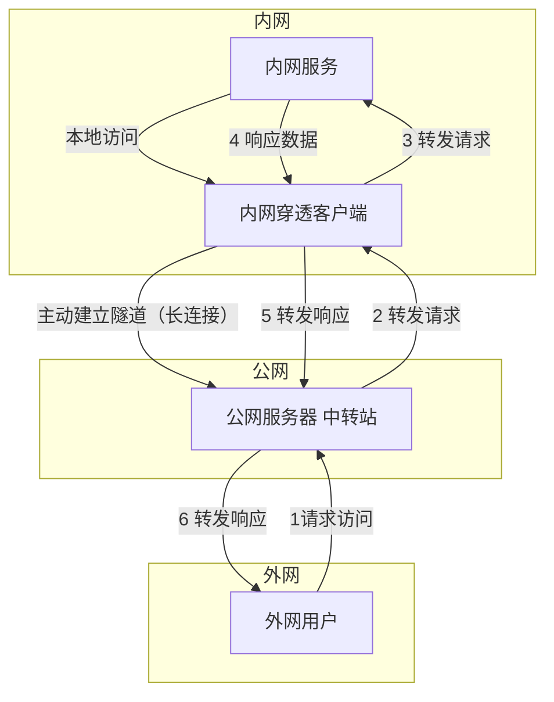

+++
date = '2024-11-18T13:27:19+08:00'
draft = false
title = 'FRP内网穿透'
+++

# 内网穿透

在ARM设备（如树莓派、Orange Pi、电视盒子等）上安装 FRP 客户端，可以让你的内网服务通过公网服务器被外部访问。整个流程主要分为 确认架构、下载对应版本、修改配置、运行客户端 几个核心步骤。

目前该方案在公网上存在一定的风险建议参考：FRP加固文章

# 原理介绍：

内网穿透的核心原理是利用一台公网服务器作为中转站，让外网用户能够访问没有公网IP的内网服务。下面用 Mermaid 流程图展示这一过程：



# **客户端**

下面是一个详细的操作指南：
🛠️ 准备工作
在开始之前，请确保你已经准备好以下两样东西：

1. 一台公网服务器：这是你的 FRP 服务端（frps），需要拥有公网 IP。它的 IP 地址和 FRP 服务端口（默认为 7000）以及认证 token 是客户端连接的关键信息。
2. ARM 设备：即你打算安装 FRP 客户端的本地设备，需要能正常联网。

📥 第一步：下载正确的 FRP 客户端版本
FRP 是跨平台的，但必须为你的 ARM 设备下载正确的架构版本。

1. 查看系统架构：在 ARM 设备上打开终端，输入以下命令来确定你的具体架构：
   
   ```bash
   uname -m
   ```
   
   根据输出结果判断：
   · 输出 aarch64：请选择 arm64 架构的版本。
2. 下载并解压：前往 FRP 的 GitHub Releases 页面 获取最新版本（例如 v0.61.1）的下载链接。然后在你的 ARM 设备上使用 wget 命令下载并解压。
   注意：客户端和服务端的版本号最好保持一致，以避免兼容性问题。
   以 arm64 架构、下载 v0.61.1 版本为例，执行以下命令：
   
   ```bash
   # 设置版本号变量
   export FRP_VERSION=0.61.1
   # 下载对应 ARM64 的压缩包
   wget "https://github.com/fatedier/frp/releases/download/v${FRP_VERSION}/frp_${FRP_VERSION}_linux_arm64.tar.gz"
   # 解压文件
   tar -xzvf frp_${FRP_VERSION}_linux_arm64.tar.gz
   # 进入解压后的目录
   cd frp_${FRP_VERSION}_linux_arm64/
   ```

⚙️ 第二步：配置 FRP 客户端
FRP 客户端的配置文件是 frpc.toml（从 v0.52.0 版本开始，配置文件格式从 .ini 改为了 .toml）。

1. 编辑配置文件：
   
   ```bash
   nano frpc.toml
   ```
   
   （你也可以使用 vim 或其他编辑器）
2. 写入配置内容：
   将以下内容复制进去，并根据你的实际情况修改 serverAddr、auth.token 以及 [[proxies]] 中的参数。

```ini
[Unit]
Description=FRP Client Service
After=network.target network-online.target
Wants=network.target

[Service]
Type=simple
User=nobody
Group=nogroup
WorkingDirectory=/opt/frp
ExecStart=/opt/frp/frpc -c /opt/frp/frpc.toml
Restart=always          # 客户端建议 always，保证断线重连
RestartSec=5s
TimeoutStopSec=30
KillSignal=SIGTERM
KillMode=process
ExecReload=/bin/kill -SIGUSR1 $MAINPID

[Install]
WantedBy=multi-user.target
```

   · remotePort = 6000 意味着，之后你在外部访问 公网服务器IP:6000，流量就会被转发到这台 ARM 设备的 22 端口（SSH）上。

🚀 第三步：运行 FRP 客户端
有两种常见的方式运行客户端：直接启动（用于测试）或配置为系统服务（推荐，用于长期运行）。

· 方式：使用 systemd 配置为服务（推荐）
  这样 FRP 客户端可以后台运行，并实现开机自启动。

1. 创建服务文件：
   
   ```bash
   sudo vim /etc/systemd/system/frpc.service
   ```

2. 写入服务配置：
   将以下内容复制进去，务必修改 ExecStart 中的路径为你实际存放 frpc 程序的绝对路径。
   
   ```ini
   [Unit]
   Description = frp client
   After = network.target syslog.target
   Wants = network.target
   
   [Service]
   Type = simple
   # 重要：请将 /path/to/ 替换为你的实际路径！
   ExecStart = /path/to/frpc -c /path/to/frpc.toml
   Restart=always  # 设置总是自动重启
   
   [Install]
   WantedBy = multi-user.target
   ```

3. 启动并启用服务：
   
   ```bash
   # 重新加载 systemd 配置
   sudo systemctl daemon-reload
   # 启动 frpc 服务
   sudo systemctl start frpc
   # 设置开机自启
   sudo systemctl enable frpc
   # 查看服务运行状态
   sudo systemctl status frpc
   ```

✅ 第四步：验证连接

在你的公网服务器上，或者在任何一台能上网的电脑上，尝试通过 SSH 连接你的 ARM 设备。如果你按照上面的 SSH 例子配置了，命令如下：

```bash
ssh -p 6000 你的用户名@你的公网服务器IP
```

如果能够成功登录你的 ARM 设备，那么恭喜你，FRP 客户端已经安装并配置成功了！

· 版本差异：请留意 FRP 不同版本间的差异，尤其是在 v0.52.0 前后，配置文件的格式和字段名有较大变化（例如 server_addr 变为了 serverAddr）。如果参考旧教程，记得做相应调整。
· 防火墙：确保你的公网服务器防火墙和安全组策略已经放行了配置文件中所使用的 remotePort（例如上面的 6000 端口）。

# 服务端

配置 FRP 服务端（frps）与配置客户端类似，核心也是下载对应系统的程序和编辑配置文件。服务端通常部署在具有公网 IP 的服务器上，下面是具体的配置步骤和常用参数说明。

🚀 第一步：下载与准备 FRP 服务端

在开始之前，请先登录到你的公网服务器VPS上。

1. 确认系统架构：在服务器上运行 uname -m，确认是 x86_64、aarch64 还是其他架构，以便下载正确的版本。
2. 下载 FRP：前往 FRP GitHub Releases 页面 获取最新版本（例如 v0.61.1）的下载链接。在服务器上使用 wget 下载并解压。
   
   ```bash
   # 设置版本号变量
   export FRP_VERSION=0.61.1
   # 下载对应系统架构的压缩包，这里以 Linux amd64 为例
   wget "https://github.com/fatedier/frp/releases/download/v${FRP_VERSION}/frp_${FRP_VERSION}_linux_amd64.tar.gz"
   # 解压文件
   tar -xzvf frp_${FRP_VERSION}_linux_amd64.tar.gz
   # 进入解压后的目录
   cd frp_${FRP_VERSION}_linux_amd64/
   ```
   
   注意：请将示例中的 linux_amd64 替换为你的服务器实际架构。解压后的目录中，frps 是服务端程序，frps.toml 是服务端配置文件。

⚙️ 第二步：配置 FRP 服务端

FRP 服务端的配置文件是 frps.toml。从 v0.52.0 版本开始，配置文件格式从 .ini 改为了 .toml。如果你使用的是旧版本，则配置文件名为 frps.ini，格式略有不同。

1. 编辑配置文件：
   
   ```bash
   vim frps.toml
   ```

2. 写入基础配置：
   一个最基本的配置只需要设置监听端口和认证令牌。将以下内容复制进去，并根据你的实际情况修改。
   
   ```toml
   # frps.toml
   
   # 服务端监听端口，用于接收 frpc 的连接，默认 7000
   bindPort = 7000
   
   # 服务端监听的地址，默认 0.0.0.0 表示监听所有可用网络接口
   bindAddr = "0.0.0.0"
   
   # === 鉴权配置 ===
   auth.method = "token"
   # 设置一个复杂的 token，客户端需要配置相同的值才能连接
   auth.token = "your_secure_token_here"   # 请替换为你自己的复杂 token
   
   # === 可选：Web 管理界面 (Dashboard) ===
   # 启用后可以通过浏览器查看服务端状态和代理信息
   webServer.addr = "0.0.0.0"
   webServer.port = 7500
   webServer.user = "admin"
   webServer.password = "admin"
   
   # === 日志配置 ===
   log.to = "./frps.log"
   log.level = "info"
   log.maxDays = 3
   ```
   
   · bindPort = 7000：这是 frp 服务端的主端口，客户端将通过此端口连接。
   · auth.token：一个用于客户端认证的密码，非常重要，可以有效防止未授权的连接。
   · webServer：配置好 Dashboard 后，你可以通过 http://你的服务器IP:7500 访问一个图形化管理界面，方便查看连接状态。

3. 高级配置（按需添加）：
   根据你要穿透的服务类型，可能还需要添加以下配置：
   · 支持 HTTP/HTTPS 穿透：如果你希望通过域名直接访问内网的 Web 服务，需要设置 vhostHTTPPort 和 vhostHTTPSPort。
   
   ```toml
   vhostHTTPPort = 80
   vhostHTTPSPort = 443
   ```
   
   · 限制客户端可使用的端口：为了提高安全性，可以限制单个客户端允许绑定哪些服务端端口。
   
   ```toml
   # 只允许客户端使用 6000-6005 和 7000 这两个端口
   allowPorts = [
     { start = 6000, end = 6005 },
     { single = 7000 }
   ]
   ```

🚀 第三步：运行 FRP 服务端

同样有两种方式运行：直接启动（用于测试）或配置为系统服务（推荐用于生产环境）。

· 方式：使用 systemd 配置为服务（推荐）
  这样 FRP 服务端可以后台运行，并实现开机自启动。

1. 创建服务文件：
   
   ```bash
   sudo vim /etc/systemd/system/frps.service
   ```
2. 写入服务配置：
   将以下内容复制进去，务必修改 ExecStart 中的路径为你实际存放 frps 程序的绝对路径。

```ini
[Unit]
Description=FRP Server Service
After=network.target network-online.target
Wants=network.target

[Service]
Type=simple
# 运行服务的用户（可选，建议使用非 root 用户）
User=nobody
Group=nogroup
# 工作目录，设置为 FRP 程序所在目录
WorkingDirectory=/opt/frp
# 启动命令，请根据实际路径修改
ExecStart=/opt/frp/frps -c /opt/frp/frps.toml
# 重启策略
Restart=on-failure
RestartSec=5s
# 停止超时时间
TimeoutStopSec=30
# 优雅停止信号
KillSignal=SIGTERM
# 如果进程有子进程，一并杀死
KillMode=process
# 可选：允许在运行时重新加载配置（发送 SIGUSR1 信号）
ExecReload=/bin/kill -SIGUSR1 $MAINPID

[Install]
WantedBy=multi-user.target
```

3. 启动并启用服务：
   
   ```bash
   # 重新加载 systemd 配置
   sudo systemctl daemon-reload
   # 启动 frps 服务
   sudo systemctl start frps
   # 设置开机自启
   sudo systemctl enable frps
   # 查看服务运行状态
   sudo systemctl status frps
   ```

🔥 第四步：防火墙与安全组配置

这是最关键的一步，否则外部连接无法到达你的 frp 服务端。你需要登录到云服务商的控制台或服务器防火墙，放行以下端口：

· bindPort (例如 7000)：必须放行，这是客户端连接的端口。
· webServer.port (例如 7500)：如果配置了 Dashboard，需要放行此端口以便访问管理界面。
· 客户端配置的 remotePort：你需要为每一个穿透规则中定义的 remotePort（例如 SSH 穿透的 6000）在服务端防火墙上放行。外部用户正是通过访问 你的服务器IP:remotePort 来连接你的内网服务的。

✅ 验证
完成以上所有步骤后，你的 FRP 服务端就已经就绪，等待客户端连接了。你可以通过 systemctl status frps 查看服务端状态，或者访问配置的 Dashboard 地址（http://你的服务器IP:7500）来监控连接情况。
现在，服务端已经配置完毕，可以回头去检查你的 ARM 设备客户端配置是否与服务端信息（serverAddr、serverPort、auth.token）一致，然后启动客户端，就能实现内网穿透了。如果在配置过程中遇到任何问题，比如服务启动失败，可以随时再来问我。

# 问题自检

在 Ubuntu 上查看端口是否开放，通常需要检查两个方面：端口是否被程序监听（服务是否在运行）和防火墙是否放行了该端口。下面介绍常用的命令。

---

1. 查看端口监听状态
   要查看当前系统上哪些端口正在被程序监听，可以使用 netstat、ss 或 lsof。
   使用 ss（推荐，现代 Linux 默认安装）
   
   ```bash
   sudo ss -tulpn
   ```

· -t：显示 TCP 端口
· -u：显示 UDP 端口
· -l：仅显示监听状态的端口
· -p：显示占用端口的进程信息（需要 sudo）
· -n：不解析服务名称，直接显示端口号
示例输出：

```
Netid  State   Recv-Q  Send-Q  Local Address:Port  Peer Address:Port  Process
tcp    LISTEN  0       128         0.0.0.0:22         0.0.0.0:*      users:(("sshd",pid=1234,fd=3))
tcp    LISTEN  0       128            [::]:22            [::]:*      users:(("sshd",pid=1234,fd=4))
```

这里显示 22 端口（SSH）正在监听。
使用 netstat

```bash
sudo netstat -tulpn
```

参数含义与 ss 类似。如果提示 netstat 未安装，可以通过 sudo apt install net-tools 安装。
使用 lsof

```bash
sudo lsof -i :端口号
```

例如查看 7000 端口：

```bash
sudo lsof -i :7000
```

如果有输出，表示该端口正在被使用；没有输出则未被监听。

---

2. 查看防火墙规则

Ubuntu 通常使用 ufw（Uncomplicated Firewall）管理防火墙，也可能直接使用 iptables。
查看 ufw 状态

```bash
sudo ufw status verbose
```

如果防火墙未启用，会显示 Status: inactive。如果已启用，会列出允许和拒绝的规则。

示例输出：

```
Status: active
Logging: on (low)
Default: deny (incoming), allow (outgoing), disabled (routed)
New profiles: skip

To                         Action      From
--                         ------      ----
22/tcp                     ALLOW IN    Anywhere
7000/tcp                   ALLOW IN    Anywhere
```

这里表示 22 和 7000 端口被允许入站。

查看 iptables 规则
如果使用的是 iptables，可以运行：

```bash
sudo iptables -L -n -v
```

这会列出所有链的规则，从中可以找到开放的端口。

---

3. 综合判断
   · 如果某个端口在 ss -tulpn 中显示为 LISTEN，说明服务正在监听。
   · 同时，如果防火墙已启用且规则允许该端口，则外部能够访问（还需要考虑云平台安全组）。
   · 如果防火墙未启用（inactive），则默认所有端口都允许入站（取决于云平台安全组）。

---

额外：从外部测试端口是否可达
如果要在另一台机器上测试端口是否开放，可以使用 telnet 或 nc：

```bash
telnet 你的服务器IP 端口号
```

或

```bash
nc -zv 你的服务器IP 端口号
```

连接成功表示端口开放，连接失败则可能被防火墙或服务本身阻挡。

---

希望这些命令能帮你确认端口状态。如果还有具体问题（例如某个端口明明监听了却连不上），可以再详细描述。
