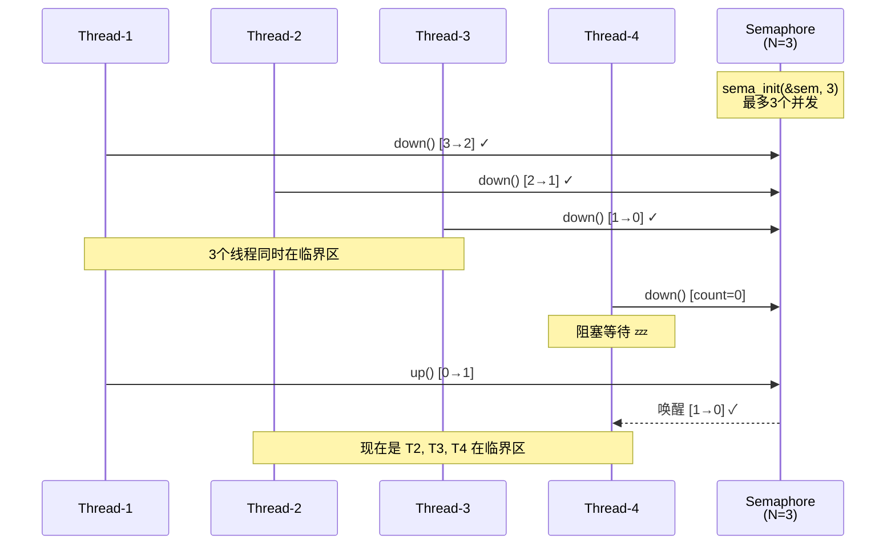

+++
date = '2026-04-08T22:30:36+08:00'
draft = false
title = '信号量基础'
categories = ['sync']
+++

# 信号量基础

​信号量（semaphore）是操作系统中最常用的同步原语之一。自旋锁是实现一种忙等待的锁，信号量则允许进程进入睡眠状态。简单来说，信号量是一个计数器，它支持两个操作原语，即P和V操作。P和V取自荷兰语中的两个单词，分别表示减少
信号量中最经典的例子莫过于生产者和消费者问题，它是一个操作系统发展历史上最经典的进程同步问题，最早由Dijkstra提出。假设生产者生产商品，消费者购买

**典型的例子：**

​	假设生产者生产商品，消费者购买商品，通常消费者需要到实体商店或者网上商城购买。用计算机来模拟这个场景，一个线程代表生产者，另一个线程代表消费者，内存代表商店。生产者生产的商品被放置到内存中供消费者线程消费；消费者线程从内存中获取物品，然后释放内存。当生产者线程生产商品时发现没有空闲内存可用，那么生产者必须等待消费者线程释放出一个空闲内存。当消费者线程购买商品时发现商店没货了，那么消费者必须等待，直到新的商品生产出来。

**如果是自旋锁**当消费者发现商品没货，那就搬个凳子坐在商店门口一直等送货员送货过来；
**如果是信号量**商店服务员会记录消费者的电话，等到货了通知消费者来购买。显然在现实生活中，如果是面包等一类可以很快做好的商品，大家愿意在商店里等；如果是家电等商品，大家肯定不会在商店里等。

​	这个还可以用进门拿钥匙这个例子也比较形象！！《linux_kernel系统设计》

## 数据结构：

```c
struct semaphore {
      raw_spinlock_t　lock;
      unsigned int count;  信号量的核心
      struct list_head wait_list;
};
```

lock是自旋锁变量，用于对信号量数据结构里count和wait_list成员的保护。

count表示允许进入临界区的内核执行路径个数。

wait_list链表用于管理所有在该信号量上睡眠的进程，没有成功获取锁的进程会睡眠在这个链表上。

​		信号量有一个有趣的特点，它可以同时允许任意数量的锁持有者。信号量初始化函数为sema_init(struct semaphore *sem, int count)，其中count的值可以大于等于1。当count大于1时，表示允许在同一时刻至多有count个锁持有者，操作系统书中把这种信号量叫作计数信号量；当count等于1时，同一时刻仅允许一个人持有锁，操作系统书中把这种信号量称为互斥信号量或者二进制信号量。在Linux内核中，大多使用count计数为1的信号量。相比自旋锁，信号量是一个允许睡眠的锁。信号量适用于一些情况复杂、加锁时间比较长的应用场景，例如内核与用户空间复杂的交互行为等。

**信号量（Semaphore）** 是Linux内核中的一种同步机制，用于控制多个进程或线程对共享资源的访问。它是一种**计数信号量**，通过一个整数值来控制访问权限：

- **正数值**：表示可用资源的数量
- **零值**：表示没有可用资源，但没有等待者
- **负值**：表示没有可用资源，且绝对值表示等待该资源的进程/线程数

信号量的核心操作：

- **down()/P操作**：获取信号量，减少计数值
- **up()/V操作**：释放信号量，增加计数值


3个信号量同时并发：




## Linux内核信号量机制：

**down的实现核心源码：**

```
void down(struct semaphore *sem)
{
	unsigned long flags;
	might_sleep();
	raw_spin_lock_irqsave(&sem->lock, flags);
	if (likely(sem->count > 0))
		sem->count--;
	else
		__down(sem);
	raw_spin_unlock_irqrestore(&sem->lock, flags);
}
```


# 内核态使用接口：

## 信号量家族 (Semaphore Family)

### 1 信号量类型

| 类型         | 头文件              | 用途           |
| :----------- | :------------------ | :------------- |
| semaphore    | <linux/semaphore.h> | 通用计数信号量 |
| rw_semaphore | <linux/rwsem.h>     | 读写信号量     |

### 2 计数信号量 API

| API                  | 说明              |
| :------------------- | :---------------- |
| sema_init(sem, val)  | 初始化为 val      |
| down()               | P操作，可能睡眠   |
| down_interruptible() | 可被信号中断      |
| down_killable()      | 可被致命信号中断  |
| down_trylock()       | 尝试，不阻塞      |
| down_timeout()       | 带超时            |
| up()                 | V操作，唤醒等待者 |

### 3 读写信号量 API

| API                       | 说明           |
| :------------------------ | :------------- |
| down_read()               | 获取读锁       |
| down_read_trylock()       | 尝试获取读锁   |
| down_read_interruptible() | 可中断读锁     |
| up_read()                 | 释放读锁       |
| down_write()              | 获取写锁       |
| down_write_trylock()      | 尝试获取写锁   |
| down_write_killable()     | 可杀死写锁     |
| up_write()                | 释放写锁       |
| downgrade_write()         | 写锁降级为读锁 |

### 4 读写信号量实现演进

| 实现                | 特点                                   |
| :------------------ | :------------------------------------- |
| 传统实现            | 简单自旋锁+计数器                      |
| Optimistic Spinning | 类似mutex的乐观自旋                    |
| Percpu-rwsem        | <linux/percpu-rwsem.h>, 极端优化读路径 |

# 用户态POSIX 信号量接口

| 接口            | 原型                                                         | 作用                       | 是否阻塞   | 典型使用场景 |
| --------------- | ------------------------------------------------------------ | -------------------------- | ---------- | ------------ |
| `sem_init`      | `int sem_init(sem_t *sem, int pshared, unsigned int value);` | 初始化匿名信号量           | 否         | 线程间同步   |
| `sem_destroy`   | `int sem_destroy(sem_t *sem);`                               | 销毁匿名信号量             | 否         | 释放资源     |
| `sem_wait`      | `int sem_wait(sem_t *sem);`                                  | P 操作（减 1，不够则阻塞） | 是         | 资源获取     |
| `sem_trywait`   | `int sem_trywait(sem_t *sem);`                               | 非阻塞 P 操作              | 否         | 尝试获取资源 |
| `sem_timedwait` | `int sem_timedwait(sem_t *sem, const struct timespec *abs_timeout);` | 超时等待                   | 是（有限） | 避免死等     |
| `sem_post`      | `int sem_post(sem_t *sem);`                                  | V 操作（加 1，唤醒等待者） | 否         | 资源释放     |