+++
date = '2026-04-08T22:30:36+08:00'
draft = false
title = 'Linux 内核信号量梳理'
categories = ['sync']
+++

## Linux 内核 `struct semaphore`
### 结构体定义
```include/linux/semaphore.h
struct semaphore {
	raw_spinlock_t		lock;
	unsigned int		count;
	struct list_head	wait_list;
};
```

---

### 字段说明

#### 1. `count` 的语义

**类型**: `unsigned int`

**含义**: 表示**还有多少个任务可以获取该信号量**。

源码注释明确说明：

```22:25:kernel/locking/semaphore.c
 * The ->count variable represents how many more tasks can acquire this
 * semaphore.  If it's zero, there may be tasks waiting on the wait_list.
```

- `count > 0`: 信号量可用，还可以有 `count` 个任务获取它
- `count == 0`: 信号量已被完全占用，后续请求者需要等待

#### 2. `wait_list` 的作用

**类型**: `struct list_head`

**含义**: 一个双向链表头，用于管理所有**等待获取该信号量的任务**。

当任务无法立即获取信号量时（`count == 0`），会创建一个 `semaphore_waiter` 结构并加入此链表：

```197:201:kernel/locking/semaphore.c
struct semaphore_waiter {
	struct list_head list;
	struct task_struct *task;
	bool up;
};
```

等待者按 FIFO 顺序排队，确保公平性。

#### 3. 锁保护机制

**类型**: `raw_spinlock_t lock`

**作用**: 保护 `count` 和 `wait_list` 的并发访问。

源码注释说明：

```15:21:kernel/locking/semaphore.c
 * The spinlock controls access to the other members of the semaphore.
 * down_trylock() and up() can be called from interrupt context, so we
 * have to disable interrupts when taking the lock.  It turns out various
 * parts of the kernel expect to be able to use down() on a semaphore in
 * interrupt context when they know it will succeed, so we have to use
 * irqsave variants for down(), down_interruptible() and down_killable()
 * too.
```

使用 `raw_spinlock_t` 而非普通 `spinlock_t`，是因为在 RT (PREEMPT_RT) 内核中，`raw_spinlock` 保持真正的自旋行为，不会被抢占。

---

### `down()` 操作流程

```kernel/locking/semaphore.c
void down(struct semaphore *sem)
{
	unsigned long flags;

	might_sleep();
	raw_spin_lock_irqsave(&sem->lock, flags);
	if (likely(sem->count > 0))
		sem->count--;
	else
		__down(sem);
	raw_spin_unlock_irqrestore(&sem->lock, flags);
}
```

**访问模式**:

| 步骤 | 操作                                            | 说明                               |
| ---- | ----------------------------------------------- | ---------------------------------- |
| 1    | `raw_spin_lock_irqsave(&sem->lock, flags)`      | 获取自旋锁并关中断                 |
| 2    | 检查 `sem->count > 0`                           | 快速路径判断                       |
| 3a   | `sem->count--`                                  | 若可用，直接递减计数               |
| 3b   | `__down(sem)`                                   | 若不可用，进入慢速路径（睡眠等待） |
| 4    | `raw_spin_unlock_irqrestore(&sem->lock, flags)` | 释放锁并恢复中断                   |

**慢速路径 `__down_common()`**:

```208:228:kernel/locking/semaphore.c
static inline int __sched __down_common(struct semaphore *sem, long state,
								long timeout)
{
	struct semaphore_waiter waiter;

	list_add_tail(&waiter.list, &sem->wait_list);
	waiter.task = current;
	waiter.up = false;

	for (;;) {
		if (signal_pending_state(state, current))
			goto interrupted;
		if (unlikely(timeout <= 0))
			goto timed_out;
		__set_current_state(state);
		raw_spin_unlock_irq(&sem->lock);
		timeout = schedule_timeout(timeout);
		raw_spin_lock_irq(&sem->lock);
		if (waiter.up)
			return 0;
	}
```

关键点：

- 将当前任务加入 `wait_list` 尾部
- **释放锁后调用 `schedule_timeout()` 睡眠**，唤醒后重新获取锁
- 通过 `waiter.up` 标志判断是否被 `up()` 唤醒

---

### `up()` 操作流程

```182:192:kernel/locking/semaphore.c
void up(struct semaphore *sem)
{
	unsigned long flags;

	raw_spin_lock_irqsave(&sem->lock, flags);
	if (likely(list_empty(&sem->wait_list)))
		sem->count++;
	else
		__up(sem);
	raw_spin_unlock_irqrestore(&sem->lock, flags);
}
```

**访问模式**:

| 步骤 | 操作                                            | 说明                   |
| ---- | ----------------------------------------------- | ---------------------- |
| 1    | `raw_spin_lock_irqsave(&sem->lock, flags)`      | 获取自旋锁             |
| 2    | 检查 `list_empty(&sem->wait_list)`              | 判断是否有等待者       |
| 3a   | `sem->count++`                                  | 无等待者，直接增加计数 |
| 3b   | `__up(sem)`                                     | 有等待者，唤醒队首任务 |
| 4    | `raw_spin_unlock_irqrestore(&sem->lock, flags)` | 释放锁                 |

**唤醒等待者 `__up()`**:

```259:266:kernel/locking/semaphore.c
static noinline void __sched __up(struct semaphore *sem)
{
	struct semaphore_waiter *waiter = list_first_entry(&sem->wait_list,
						struct semaphore_waiter, list);
	list_del(&waiter->list);
	waiter->up = true;
	wake_up_process(waiter->task);
}
```

关键点：

- 取出链表**第一个等待者**（FIFO）
- 设置 `waiter->up = true` 通知等待者已获得信号量
- 调用 `wake_up_process()` 唤醒该任务
- **注意**: 不增加 `count`，因为信号量直接"传递"给被唤醒的任务

---

### 总结

| 字段        | 类型               | 作用                   | 保护方式    |
| ----------- | ------------------ | ---------------------- | ----------- |
| `lock`      | `raw_spinlock_t`   | 保护其他字段的并发访问 | -           |
| `count`     | `unsigned int`     | 可用资源计数           | `lock` 保护 |
| `wait_list` | `struct list_head` | 等待任务队列           | `lock` 保护 |

这种设计实现了**计数信号量**的经典语义：允许最多 `n` 个任务同时持有信号量，超出的任务按 FIFO 顺序排队等待。

```plaintext
struct semaphore {
	raw_spinlock_t		lock;
	unsigned int		count;
	struct list_head	wait_list;
};
```

```c
 * The ->count variable represents how many more tasks can acquire this
 * semaphore.  If it's zero, there may be tasks waiting on the wait_list.
```

```c
struct semaphore_waiter {
	struct list_head list;
	struct task_struct *task;
	bool up;
};
```

```c
 * The spinlock controls access to the other members of the semaphore.
 * down_trylock() and up() can be called from interrupt context, so we
 * have to disable interrupts when taking the lock.  It turns out various
 * parts of the kernel expect to be able to use down() on a semaphore in
 * interrupt context when they know it will succeed, so we have to use
 * irqsave variants for down(), down_interruptible() and down_killable()
 * too.
```

```c
void down(struct semaphore *sem)
{
	unsigned long flags;

	might_sleep();
	raw_spin_lock_irqsave(&sem->lock, flags);
	if (likely(sem->count > 0))
		sem->count--;
	else
		__down(sem);
	raw_spin_unlock_irqrestore(&sem->lock, flags);
}
```

```c
static inline int __sched __down_common(struct semaphore *sem, long state,
								long timeout)
{
	struct semaphore_waiter waiter;

	list_add_tail(&waiter.list, &sem->wait_list);
	waiter.task = current;
	waiter.up = false;

	for (;;) {
		if (signal_pending_state(state, current))
			goto interrupted;
		if (unlikely(timeout <= 0))
			goto timed_out;
		__set_current_state(state);
		raw_spin_unlock_irq(&sem->lock);
		timeout = schedule_timeout(timeout);
		raw_spin_lock_irq(&sem->lock);
		if (waiter.up)
			return 0;
	}
```

```c
void up(struct semaphore *sem)
{
	unsigned long flags;

	raw_spin_lock_irqsave(&sem->lock, flags);
	if (likely(list_empty(&sem->wait_list)))
		sem->count++;
	else
		__up(sem);
	raw_spin_unlock_irqrestore(&sem->lock, flags);
}
```

```c
static noinline void __sched __up(struct semaphore *sem)
{
	struct semaphore_waiter *waiter = list_first_entry(&sem->wait_list,
						struct semaphore_waiter, list);
	list_del(&waiter->list);
	waiter->up = true;
	wake_up_process(waiter->task);
}
```

---

## `down()` 完整执行路径分析

### 1. 涉及的核心函数

| 函数                           | 位置                             | 作用                      |
| ------------------------------ | -------------------------------- | ------------------------- |
| `down()`                       | `kernel/locking/semaphore.c:53`  | 入口函数                  |
| `might_sleep()`                | 内核调试宏                       | 检测非法上下文调用        |
| `raw_spin_lock_irqsave()`      | spinlock API                     | 获取锁并保存中断状态      |
| `__down()`                     | `kernel/locking/semaphore.c:239` | 慢速路径入口              |
| `__down_common()`              | `kernel/locking/semaphore.c:208` | 核心等待逻辑              |
| `list_add_tail()`              | list API                         | 加入等待队列              |
| `__set_current_state()`        | 进程状态 API                     | 设置进程为不可中断睡眠    |
| `raw_spin_unlock_irq()`        | spinlock API                     | 释放锁                    |
| `schedule_timeout()`           | `kernel/time/timer.c`            | **调度点 - 主动让出 CPU** |
| `raw_spin_lock_irq()`          | spinlock API                     | 重新获取锁                |
| `raw_spin_unlock_irqrestore()` | spinlock API                     | 释放锁并恢复中断          |

---

### 2. 睡眠点与调度点标注

```53:64:kernel/locking/semaphore.c
void down(struct semaphore *sem)
{
	unsigned long flags;

	might_sleep();                                    // ⚠️ 睡眠检查点
	raw_spin_lock_irqsave(&sem->lock, flags);
	if (likely(sem->count > 0))
		sem->count--;                             // 快速路径：不睡眠
	else
		__down(sem);                              // 慢速路径：可能睡眠
	raw_spin_unlock_irqrestore(&sem->lock, flags);
}
```

```208:228:kernel/locking/semaphore.c
static inline int __sched __down_common(struct semaphore *sem, long state,
								long timeout)
{
	struct semaphore_waiter waiter;

	list_add_tail(&waiter.list, &sem->wait_list);
	waiter.task = current;
	waiter.up = false;

	for (;;) {
		if (signal_pending_state(state, current))
			goto interrupted;
		if (unlikely(timeout <= 0))
			goto timed_out;
		__set_current_state(state);               // 💤 设置睡眠状态
		raw_spin_unlock_irq(&sem->lock);          // 释放锁
		timeout = schedule_timeout(timeout);      // 🔄 调度点：CPU让出
		raw_spin_lock_irq(&sem->lock);            // 唤醒后重新获取锁
		if (waiter.up)
			return 0;
	}
```

**关键标记**:

- ⚠️ `might_sleep()`: 调试检查，确保不在原子上下文
- 💤 `__set_current_state(TASK_UNINTERRUPTIBLE)`: 将进程状态设为不可中断睡眠
- 🔄 `schedule_timeout()`: **实际的调度点**，调用 `schedule()` 让出 CPU

---

### 3. ASCII 时序图

```
┌─────────────────────────────────────────────────────────────────────────────┐
│                        down() 执行路径时序图                                  │
└─────────────────────────────────────────────────────────────────────────────┘

调用者任务 (Task A)                              内核调度器
    │                                                │
    ▼                                                │
┌──────────────────┐                                 │
│  down(sem)       │                                 │
└────────┬─────────┘                                 │
         │                                           │
         ▼                                           │
┌──────────────────┐                                 │
│  might_sleep()   │  ← ⚠️ 检查是否在原子上下文        │
└────────┬─────────┘                                 │
         │                                           │
         ▼                                           │
┌──────────────────────────────┐                     │
│ raw_spin_lock_irqsave(lock)  │  ← 🔒 获取锁,关中断   │
└────────┬─────────────────────┘                     │
         │                                           │
         ▼                                           │
    ┌────────────┐                                   │
    │ count > 0? │                                   │
    └─────┬──────┘                                   │
          │                                          │
    ┌─────┴─────┐                                    │
    │           │                                    │
   YES          NO                                   │
    │           │                                    │
    ▼           ▼                                    │
┌────────┐  ┌────────────┐                           │
│count-- │  │ __down(sem)│                           │
└───┬────┘  └─────┬──────┘                           │
    │             │                                  │
    │             ▼                                  │
    │     ┌─────────────────────┐                    │
    │     │ __down_common(sem,  │                    │
    │     │   TASK_UNINTERRUPT, │                    │
    │     │   MAX_TIMEOUT)      │                    │
    │     └─────────┬───────────┘                    │
    │               │                                │
    │               ▼                                │
    │     ┌─────────────────────────────┐            │
    │     │ list_add_tail(waiter,       │            │
    │     │              wait_list)     │  ← 加入等待队列
    │     └─────────┬───────────────────┘            │
    │               │                                │
    │               ▼                                │
    │     ┌─────────────────────────────┐            │
    │     │ waiter.task = current       │            │
    │     │ waiter.up = false           │            │
    │     └─────────┬───────────────────┘            │
    │               │                                │
    │               ▼                                │
    │        ╔═══════════════════╗                   │
    │        ║   for (;;) 循环   ║                   │
    │        ╚════════╤══════════╝                   │
    │                 │                              │
    │                 ▼                              │
    │     ┌─────────────────────────────┐            │
    │     │ __set_current_state(        │            │
    │     │   TASK_UNINTERRUPTIBLE)     │  ← 💤 设置睡眠状态
    │     └─────────┬───────────────────┘            │
    │               │                                │
    │               ▼                                │
    │     ┌─────────────────────────────┐            │
    │     │ raw_spin_unlock_irq(lock)   │  ← 🔓 释放锁
    │     └─────────┬───────────────────┘            │
    │               │                                │
    │               ▼                                │
    │     ╔═════════════════════════════╗            │
    │     ║  schedule_timeout(timeout)  ║ ──────────►│
    │     ║                             ║            │
    │     ║  🔄 调度点: 让出CPU, 睡眠    ║            ▼
    │     ╚═════════════════════════════╝    ┌──────────────┐
    │               │                        │ 切换到其他任务│
    │               │                        │ (Task B, C...)│
    │          ─────┼─────                   └──────┬───────┘
    │          等待唤醒                              │
    │          ─────┼─────                          │
    │               │                               │
    │               │  ◄──────────────────────────  │
    │               │     up() 调用 wake_up_process()
    │               ▼                               │
    │     ┌─────────────────────────────┐           │
    │     │ raw_spin_lock_irq(lock)     │  ← 🔒 重新获取锁
    │     └─────────┬───────────────────┘           │
    │               │                               │
    │               ▼                               │
    │     ┌──────────────────┐                      │
    │     │  waiter.up == ?  │                      │
    │     └────────┬─────────┘                      │
    │              │                                │
    │        ┌─────┴─────┐                          │
    │        │           │                          │
    │      true        false                        │
    │        │           │                          │
    │        ▼           └──► 继续循环 (spurious wakeup)
    │   ┌─────────┐                                 │
    │   │return 0 │  ← 成功获取信号量                │
    │   └────┬────┘                                 │
    │        │                                      │
    │◄───────┘                                      │
    │                                               │
    ▼                                               │
┌──────────────────────────────────┐                │
│ raw_spin_unlock_irqrestore(lock) │  ← 🔓 释放锁   │
└────────┬─────────────────────────┘                │
         │                                          │
         ▼                                          │
┌──────────────────┐                                │
│  down() 返回     │                                │
└──────────────────┘                                │
```

---

### 4. 执行路径总结

#### 快速路径 (Fast Path) - `count > 0`

```
down()
  │
  ├─► might_sleep()
  ├─► raw_spin_lock_irqsave()     🔒
  ├─► count--                      ✓ 无睡眠
  └─► raw_spin_unlock_irqrestore() 🔓
      │
      └─► 返回
```

#### 慢速路径 (Slow Path) - `count == 0`

```
down()
  │
  ├─► might_sleep()
  ├─► raw_spin_lock_irqsave()           🔒
  ├─► __down()
  │     └─► __down_common()
  │           ├─► list_add_tail()        加入等待队列
  │           ├─► __set_current_state()  💤 TASK_UNINTERRUPTIBLE
  │           ├─► raw_spin_unlock_irq()  🔓
  │           ├─► schedule_timeout()     🔄 调度点 - 睡眠
  │           │     └─► schedule()       ⭐ 实际调度发生处
  │           ├─► [被 up() 唤醒]
  │           ├─► raw_spin_lock_irq()    🔒
  │           └─► 检查 waiter.up → 返回
  │
  └─► raw_spin_unlock_irqrestore()       🔓
      │
      └─► 返回
```

---

### 5. 关键时间点说明

| 阶段                         | 持有锁状态 | 进程状态            | 说明           |
| ---------------------------- | ---------- | ------------------- | -------------- |
| 进入 `down()`                | 无         | RUNNING             | 正常运行       |
| `raw_spin_lock_irqsave()` 后 | **持有**   | RUNNING             | 临界区         |
| `__set_current_state()` 后   | 持有       | **UNINTERRUPTIBLE** | 准备睡眠       |
| `raw_spin_unlock_irq()` 后   | 无         | UNINTERRUPTIBLE     | 可被调度走     |
| `schedule_timeout()` 中      | 无         | UNINTERRUPTIBLE     | **睡眠中**     |
| 被 `up()` 唤醒后             | 无         | RUNNING             | 准备重新竞争锁 |
| `raw_spin_lock_irq()` 后     | **持有**   | RUNNING             | 检查唤醒条件   |
| `down()` 返回                | 无         | RUNNING             | 已获得信号量   |

```c
void down(struct semaphore *sem)
{
	unsigned long flags;

	might_sleep();                                    // ⚠️ 睡眠检查点
	raw_spin_lock_irqsave(&sem->lock, flags);
	if (likely(sem->count > 0))
		sem->count--;                             // 快速路径：不睡眠
	else
		__down(sem);                              // 慢速路径：可能睡眠
	raw_spin_unlock_irqrestore(&sem->lock, flags);
}
```

```c
static inline int __sched __down_common(struct semaphore *sem, long state,
								long timeout)
{
	struct semaphore_waiter waiter;

	list_add_tail(&waiter.list, &sem->wait_list);
	waiter.task = current;
	waiter.up = false;

	for (;;) {
		if (signal_pending_state(state, current))
			goto interrupted;
		if (unlikely(timeout <= 0))
			goto timed_out;
		__set_current_state(state);               // 💤 设置睡眠状态
		raw_spin_unlock_irq(&sem->lock);          // 释放锁
		timeout = schedule_timeout(timeout);      // 🔄 调度点：CPU让出
		raw_spin_lock_irq(&sem->lock);            // 唤醒后重新获取锁
		if (waiter.up)
			return 0;
	}
```


---


请以 up() 为例，给出从调用 up() 到函数返回的完整执行路径。
要求：

1. 列出涉及的核心函数
2. 标明哪些地方唤醒 down做的睡眠函数，细节到调用。
3. 标明调度点 schedule() 在哪里被调用
4. 用 mermaind表示

---


现在我已经获得了完整的调用链信息。让我为您整理 `up()` 的完整执行路径分析。

## `up()` 完整执行路径分析

### 1. 涉及的核心函数

| 层级 | 函数                   | 位置                             | 作用              |
| ---- | ---------------------- | -------------------------------- | ----------------- |
| L1   | `up()`                 | `kernel/locking/semaphore.c:182` | 入口函数          |
| L2   | `__up()`               | `kernel/locking/semaphore.c:259` | 唤醒等待者        |
| L3   | `wake_up_process()`    | `kernel/sched/core.c:4221`       | 唤醒进程接口      |
| L4   | `try_to_wake_up()`     | `kernel/sched/core.c:3990`       | 核心唤醒逻辑      |
| L5   | `ttwu_queue()`         | `kernel/sched/core.c:3806`       | 加入运行队列      |
| L6   | `ttwu_do_activate()`   | `kernel/sched/core.c:3591`       | 激活任务          |
| L7   | `activate_task()`      | 调度器                           | 入队运行队列      |
| L7   | `ttwu_do_wakeup()`     | `kernel/sched/core.c:3555`       | 设置 TASK_RUNNING |
| L7   | `check_preempt_curr()` | 调度器                           | 检查是否需要抢占  |

---

### 2. 唤醒 `down()` 睡眠的关键调用链

```182:192:kernel/locking/semaphore.c
void up(struct semaphore *sem)
{
	unsigned long flags;

	raw_spin_lock_irqsave(&sem->lock, flags);
	if (likely(list_empty(&sem->wait_list)))
		sem->count++;
	else
		__up(sem);                    // 🔔 有等待者，执行唤醒
	raw_spin_unlock_irqrestore(&sem->lock, flags);
}
```

```259:266:kernel/locking/semaphore.c
static noinline void __sched __up(struct semaphore *sem)
{
	struct semaphore_waiter *waiter = list_first_entry(&sem->wait_list,
						struct semaphore_waiter, list);
	list_del(&waiter->list);          // 从等待队列移除
	waiter->up = true;                // 🔔 标记已获得信号量
	wake_up_process(waiter->task);    // 🔔 唤醒睡眠进程
}
```

```4221:4224:kernel/sched/core.c
int wake_up_process(struct task_struct *p)
{
	return try_to_wake_up(p, TASK_NORMAL, 0);  // 🔔 调用核心唤醒函数
}
```

```3555:3560:kernel/sched/core.c
static void ttwu_do_wakeup(struct rq *rq, struct task_struct *p, int wake_flags,
			   struct rq_flags *rf)
{
	check_preempt_curr(rq, p, wake_flags);  // 检查抢占
	WRITE_ONCE(p->__state, TASK_RUNNING);   // 🔔 设置进程为RUNNING状态
	trace_sched_wakeup(p);
```

---

### 3. 调度点说明

**`up()` 本身不直接调用 `schedule()`！**

但有两种情况会导致调度发生：

| 情况                 | 触发条件                                                     | 调度点位置                                                  |
| -------------------- | ------------------------------------------------------------ | ----------------------------------------------------------- |
| **抢占调度**         | `check_preempt_curr()` 判断被唤醒进程优先级更高，设置 `TIF_NEED_RESCHED` | `up()` 返回后，在 `preempt_enable()` 或中断返回时           |
| **被唤醒进程的调度** | 被唤醒进程从 `schedule_timeout()` 返回，重新获得 CPU         | 在等待者的 `__down_common()` 中的 `schedule_timeout()` 之后 |

---

### 4. 流程图

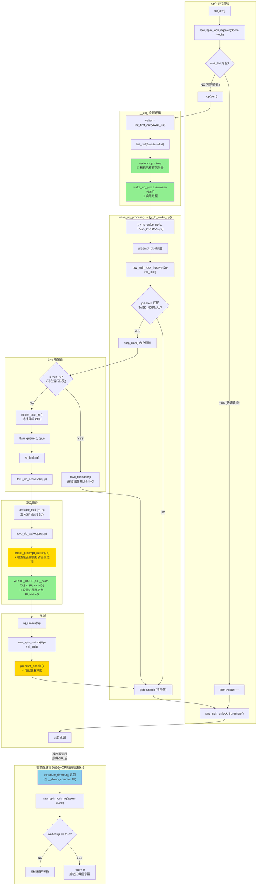

---

### 5. 时序图 

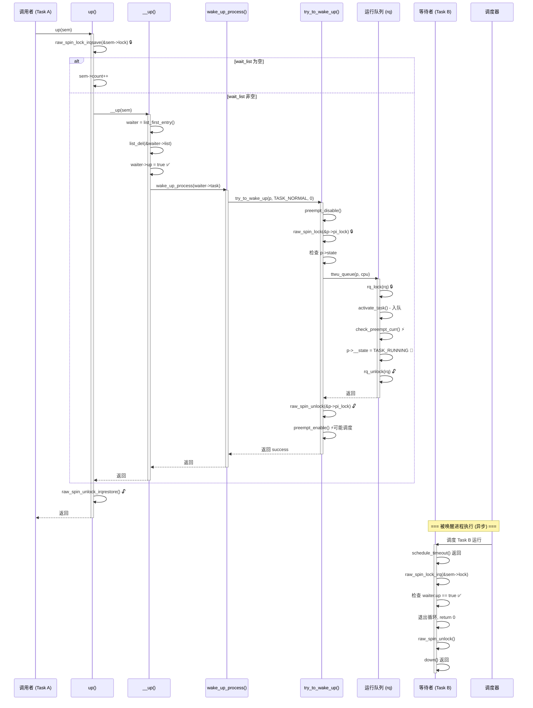

---

### 6. 关键点总结

| 要点                           | 说明                                                         |
| ------------------------------ | ------------------------------------------------------------ |
| **`up()` 不调用 `schedule()`** | `up()` 只负责唤醒，不主动让出 CPU                            |
| **唤醒点**                     | `wake_up_process()` → `try_to_wake_up()`                     |
| **状态转换**                   | `TASK_UNINTERRUPTIBLE` → `TASK_RUNNING` (在 `ttwu_do_wakeup()` 中) |
| **抢占检查**                   | `check_preempt_curr()` 决定是否设置 `TIF_NEED_RESCHED`       |
| **间接调度**                   | 如果被唤醒进程优先级更高，`preempt_enable()` 或中断返回时会触发调度 |
| **信号量传递**                 | `waiter->up = true` 告知等待者已获得信号量，不增加 `count`   |

```c
void up(struct semaphore *sem)
{
	unsigned long flags;

	raw_spin_lock_irqsave(&sem->lock, flags);
	if (likely(list_empty(&sem->wait_list)))
		sem->count++;
	else
		__up(sem);                    // 🔔 有等待者，执行唤醒
	raw_spin_unlock_irqrestore(&sem->lock, flags);
}
```

```c
static noinline void __sched __up(struct semaphore *sem)
{
	struct semaphore_waiter *waiter = list_first_entry(&sem->wait_list,
						struct semaphore_waiter, list);
	list_del(&waiter->list);          // 从等待队列移除
	waiter->up = true;                // 🔔 标记已获得信号量
	wake_up_process(waiter->task);    // 🔔 唤醒睡眠进程
}
```

```c
int wake_up_process(struct task_struct *p)
{
	return try_to_wake_up(p, TASK_NORMAL, 0);  // 🔔 调用核心唤醒函数
}
```

```c
static void ttwu_do_wakeup(struct rq *rq, struct task_struct *p, int wake_flags,
			   struct rq_flags *rf)
{
	check_preempt_curr(rq, p, wake_flags);  // 检查抢占
	WRITE_ONCE(p->__state, TASK_RUNNING);   // 🔔 设置进程为RUNNING状态
	trace_sched_wakeup(p);
```


---


我的疑惑是down下去的是那个线程，之后up如何能够精确找到，请结合源码分析。并用mermaind会画出调用时序图。

---


这是一个非常好的问题！让我结合源码详细分析 `down()` 和 `up()` 之间是如何通过 `wait_list` 精确关联的。

## `down()` 与 `up()` 如何精确关联 - 源码分析

### 核心桥梁：`struct semaphore_waiter`

```197:201:kernel/locking/semaphore.c
struct semaphore_waiter {
	struct list_head list;
	struct task_struct *task;
	bool up;
};
```

这个结构体是连接 `down()` 和 `up()` 的**关键桥梁**：

| 字段   | 作用                                  |
| ------ | ------------------------------------- |
| `list` | 链表节点，用于挂入 `sem->wait_list`   |
| `task` | **指向睡眠线程的 `task_struct` 指针** |
| `up`   | 标记该等待者是否被 `up()` 唤醒        |

---

### `down()` 时：记录"我是谁"

```211:215:kernel/locking/semaphore.c
	struct semaphore_waiter waiter;

	list_add_tail(&waiter.list, &sem->wait_list);
	waiter.task = current;
	waiter.up = false;
```

**关键点**：

1. `waiter` 是在**当前线程的内核栈**上分配的局部变量
2. `current` 是内核宏，返回当前运行线程的 `task_struct *`
3. `waiter.task = current` **记录了"我是谁"**
4. `list_add_tail()` 将 waiter 加入 `wait_list` **尾部**（FIFO 顺序）

---

### `up()` 时：精确找到等待者

```259:266:kernel/locking/semaphore.c
static noinline void __sched __up(struct semaphore *sem)
{
	struct semaphore_waiter *waiter = list_first_entry(&sem->wait_list,
						struct semaphore_waiter, list);
	list_del(&waiter->list);
	waiter->up = true;
	wake_up_process(waiter->task);
}
```

**关键点**：

1. `list_first_entry()` 取出等待队列的**第一个** waiter（FIFO，最早等待的）
2. `waiter->task` 就是睡眠线程的 `task_struct *`
3. `wake_up_process(waiter->task)` **精确唤醒该线程**
4. `waiter->up = true` 通知等待者：你已获得信号量

---

### 数据结构关系图

```
┌─────────────────────────────────────────────────────────────────────────────┐
│                         struct semaphore                                     │
├─────────────────────────────────────────────────────────────────────────────┤
│  lock       ──► raw_spinlock_t (保护下面的字段)                              │
│  count      ──► 0 (没有可用资源)                                             │
│  wait_list  ──► ┌──────────────────────────────────────────────────────┐    │
│                 │                   双向链表                            │    │
└─────────────────┴──────────────────────────────────────────────────────┴────┘
                           │
                           ▼
    ┌──────────────────────────────────────────────────────────────────────┐
    │                                                                      │
    │   ┌─────────────────────┐    ┌─────────────────────┐                │
    │   │ semaphore_waiter #1 │    │ semaphore_waiter #2 │                │
    │   │  (Thread A 的栈上)   │    │  (Thread B 的栈上)   │               │
    │   ├─────────────────────┤    ├─────────────────────┤                │
    │   │ list ◄──────────────┼────┼──► list             │   ...更多等待者│
    │   │ task ──► Thread A   │    │ task ──► Thread B   │                │
    │   │         task_struct │    │         task_struct │                │
    │   │ up = false          │    │ up = false          │                │
    │   └─────────────────────┘    └─────────────────────┘                │
    │         ▲                                                           │
    │         │                                                           │
    │   list_first_entry()                                                │
    │   up() 从这里取出第一个                                              │
    └──────────────────────────────────────────────────────────────────────┘
```

---

### 完整时序图 (Mermaid)

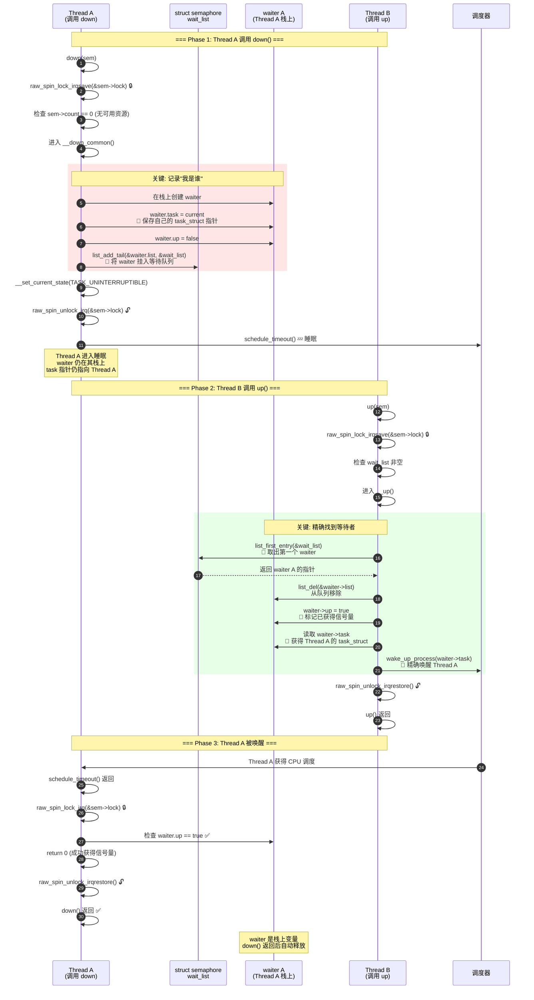

---

### 多线程等待场景

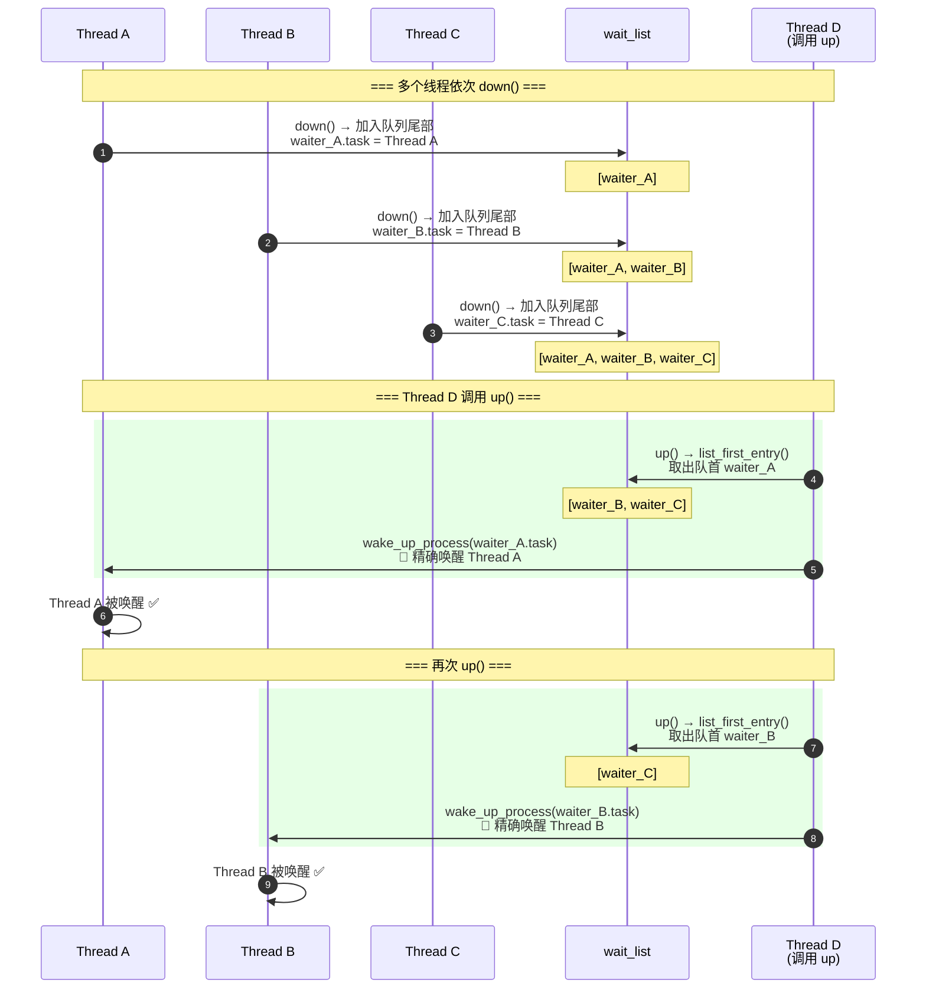

---

### 核心机制总结

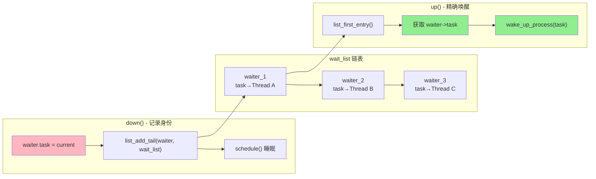

---

### 关键问答

| 问题                    | 答案                                                 |
| ----------------------- | ---------------------------------------------------- |
| **down 的是哪个线程？** | `current` - 调用 `down()` 的当前线程                 |
| **如何记录？**          | `waiter.task = current` 保存到栈上的 `waiter` 结构   |
| **waiter 存在哪？**     | 在调用 `down()` 的线程的**内核栈**上                 |
| **up 如何找到？**       | `list_first_entry(&wait_list)` 取出队首 waiter       |
| **如何精确唤醒？**      | `wake_up_process(waiter->task)` 使用保存的 task 指针 |
| **唤醒顺序？**          | FIFO - 先等待的先被唤醒                              |
| **waiter 何时释放？**   | `down()` 返回后，栈上变量自动释放                    |

这就是 `down()` 和 `up()` 如何通过 `wait_list` 和 `waiter.task` 精确关联的完整机制！

```c
struct semaphore_waiter {
	struct list_head list;
	struct task_struct *task;
	bool up;
};
```

```c
	struct semaphore_waiter waiter;

	list_add_tail(&waiter.list, &sem->wait_list);
	waiter.task = current;
	waiter.up = false;
```

```c
static noinline void __sched __up(struct semaphore *sem)
{
	struct semaphore_waiter *waiter = list_first_entry(&sem->wait_list,
						struct semaphore_waiter, list);
	list_del(&waiter->list);
	waiter->up = true;
	wake_up_process(waiter->task);
}
```

```plaintext
┌─────────────────────────────────────────────────────────────────────────────┐
│                         struct semaphore                                     │
├─────────────────────────────────────────────────────────────────────────────┤
│  lock       ──► raw_spinlock_t (保护下面的字段)                              │
│  count      ──► 0 (没有可用资源)                                             │
│  wait_list  ──► ┌──────────────────────────────────────────────────────┐    │
│                 │                   双向链表                            │    │
└─────────────────┴──────────────────────────────────────────────────────┴────┘
                           │
                           ▼
    ┌──────────────────────────────────────────────────────────────────────┐
    │                                                                      │
    │   ┌─────────────────────┐    ┌─────────────────────┐                │
    │   │ semaphore_waiter #1 │    │ semaphore_waiter #2 │                │
    │   │  (Thread A 的栈上)   │    │  (Thread B 的栈上)   │               │
    │   ├─────────────────────┤    ├─────────────────────┤                │
    │   │ list ◄──────────────┼────┼──► list             │   ...更多等待者│
    │   │ task ──► Thread A   │    │ task ──► Thread B   │                │
    │   │         task_struct │    │         task_struct │                │
    │   │ up = false          │    │ up = false          │                │
    │   └─────────────────────┘    └─────────────────────┘                │
    │         ▲                                                           │
    │         │                                                           │
    │   list_first_entry()                                                │
    │   up() 从这里取出第一个                                              │
    └──────────────────────────────────────────────────────────────────────┘
```


---


在信号量函数down中有关中断并且禁止抢占，这个的目的是什么？单核情况和多核情况都使用mermaind表示！

禁止抢占只针对当前cpu?

---


```plaintext
* The spinlock controls access to the other members of the semaphore.
* down_trylock() and up() can be called from interrupt context, so we
* have to disable interrupts when taking the lock.
```

## 信号量中关中断和禁止抢占的目的

### 源码中的关键注释

```12:21:kernel/locking/semaphore.c
/*
 * Some notes on the implementation:
 *
 * The spinlock controls access to the other members of the semaphore.
 * down_trylock() and up() can be called from interrupt context, so we
 * have to disable interrupts when taking the lock.  It turns out various
 * parts of the kernel expect to be able to use down() on a semaphore in
 * interrupt context when they know it will succeed, so we have to use
 * irqsave variants for down(), down_interruptible() and down_killable()
 * too.
```

### `raw_spin_lock_irqsave()` 做了什么？

```c
raw_spin_lock_irqsave(&sem->lock, flags);
```

| 操作                         | 作用范围    | 目的                              |
| ---------------------------- | ----------- | --------------------------------- |
| **关闭中断** (`irqsave`)     | 仅当前 CPU  | 防止中断处理程序在本 CPU 上竞争锁 |
| **禁止抢占** (spinlock 隐含) | 仅当前 CPU  | 防止持锁时被调度走                |
| **自旋锁**                   | 多 CPU 同步 | 防止其他 CPU 并发访问             |

---

## 单核情况：为什么需要关中断？

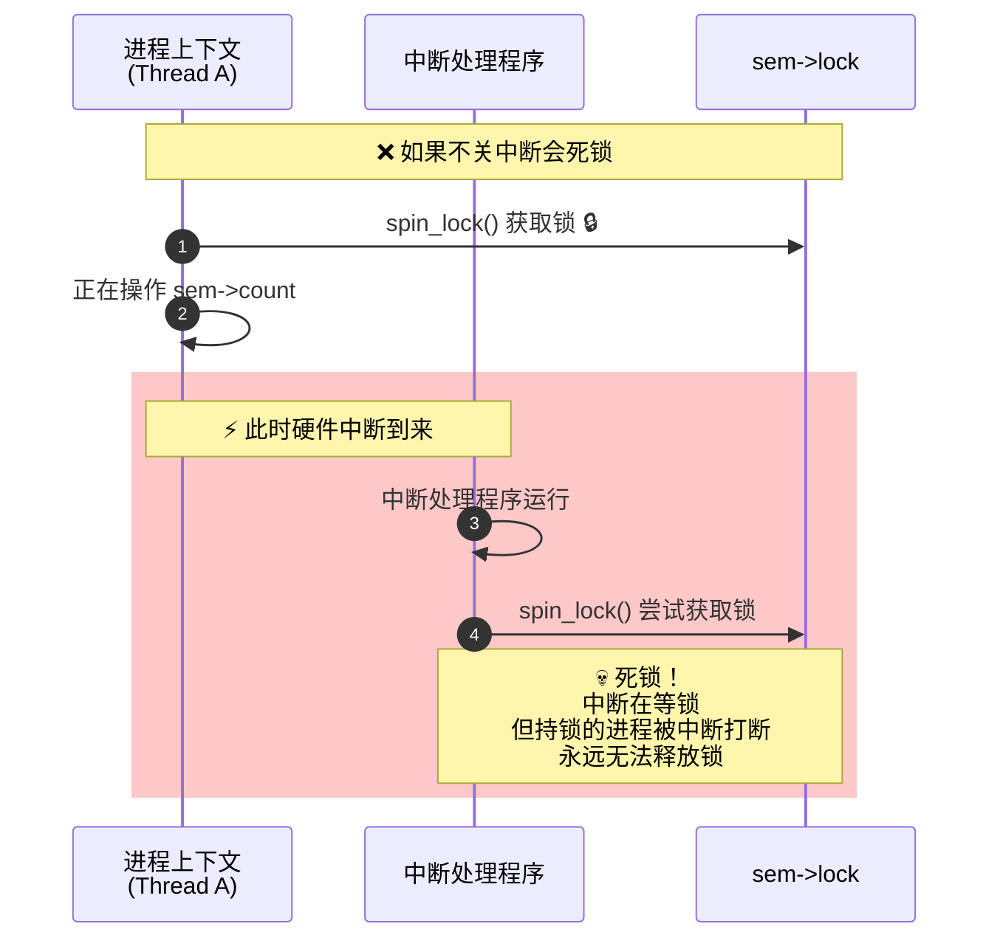

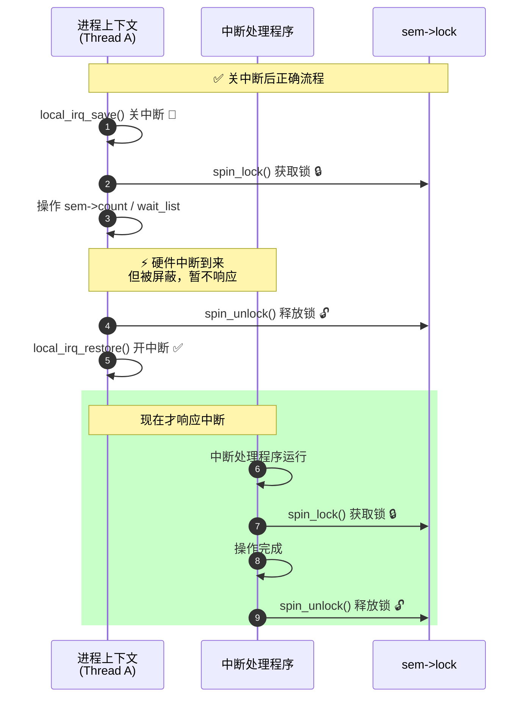

---

## 单核情况：为什么需要禁止抢占？

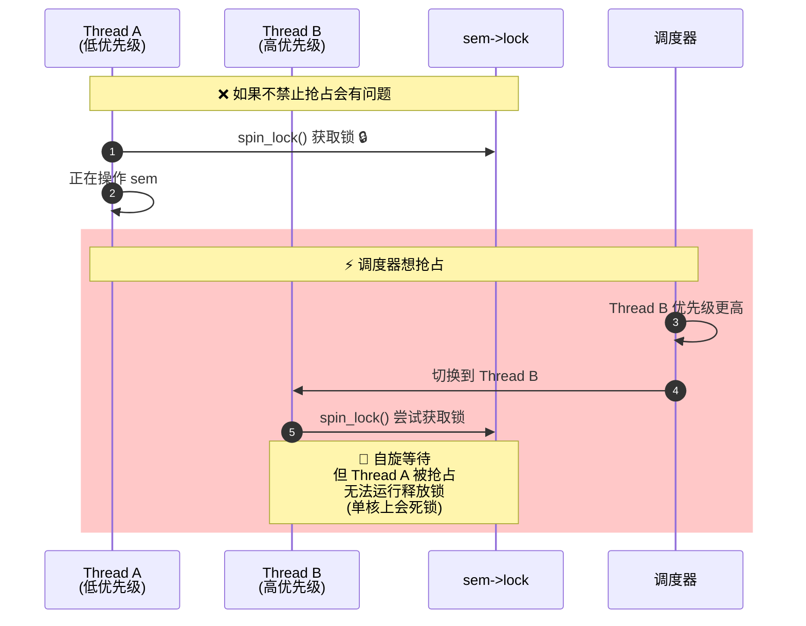

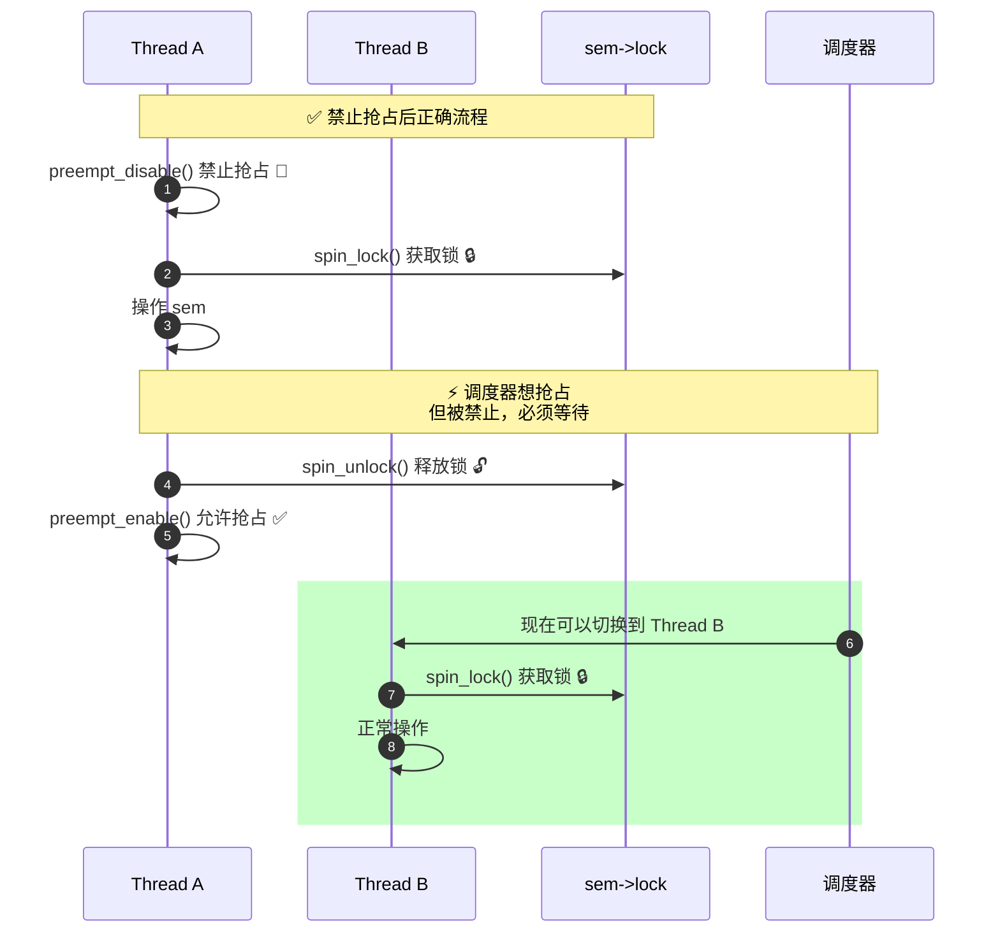

---

## 多核情况：完整保护机制

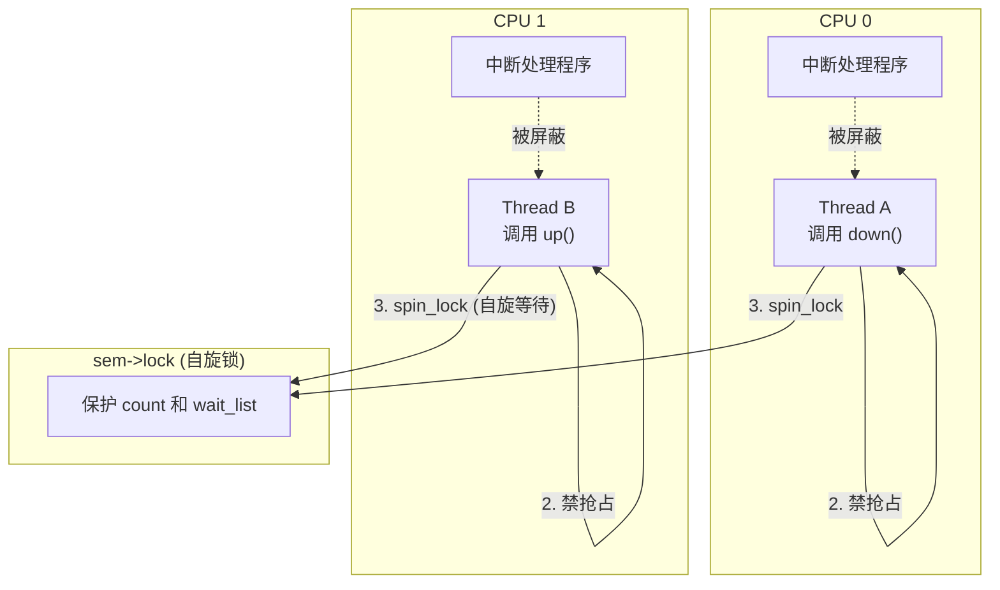


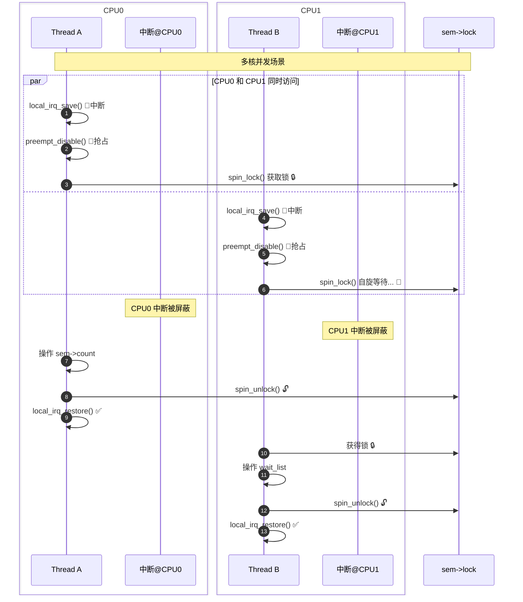

这里直接截图了上面的 mermaind


---

## 禁止抢占只针对当前 CPU？

**是的！禁止抢占只影响当前 CPU。**

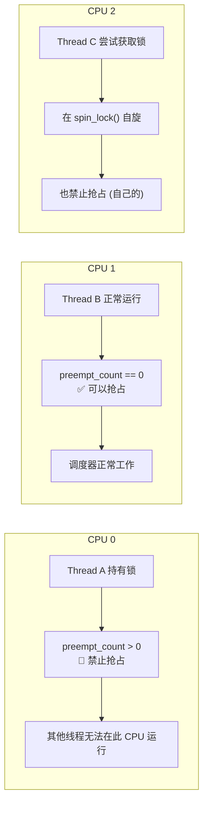

### 每个 CPU 有独立的抢占计数器

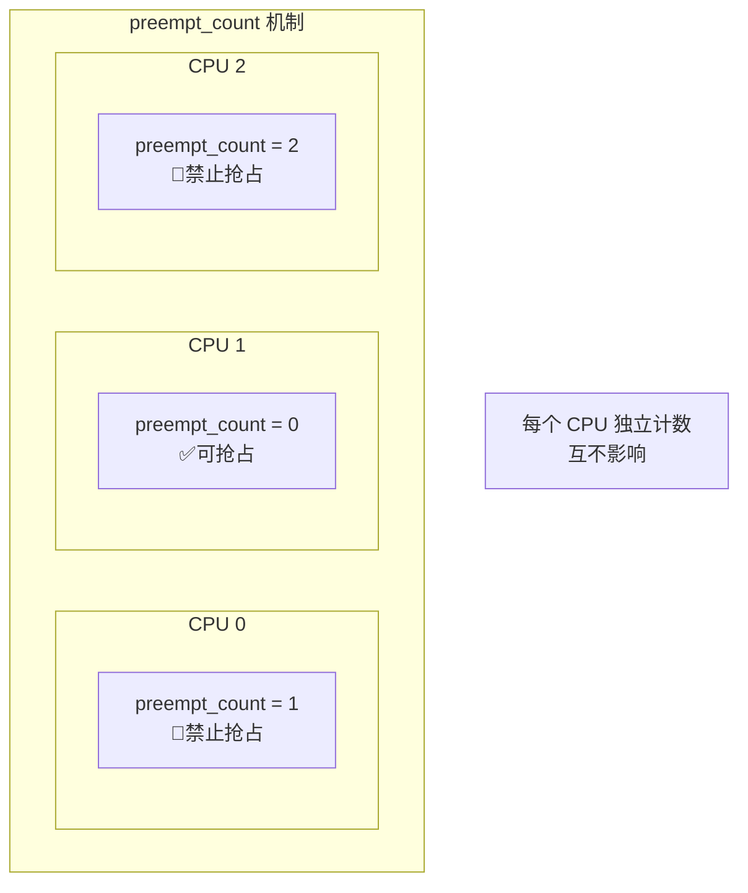

---

## 总结：三层保护机制

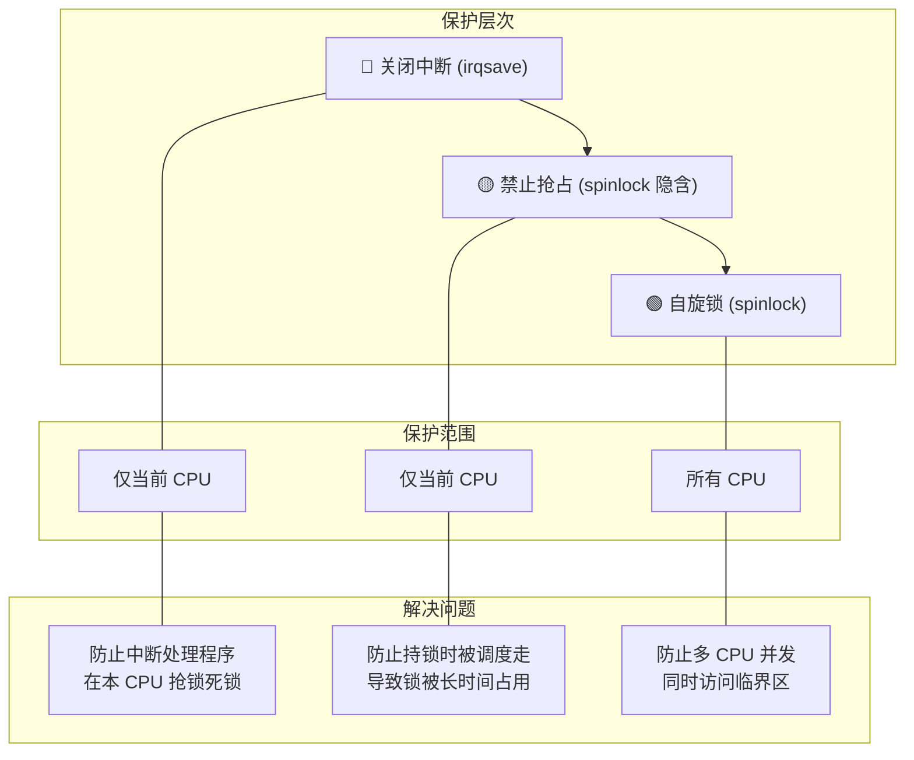

| 机制       | 范围     | 单核作用            | 多核作用            |
| ---------- | -------- | ------------------- | ------------------- |
| **关中断** | 当前 CPU | 防止中断死锁        | 防止本 CPU 中断死锁 |
| **禁抢占** | 当前 CPU | 防止抢占死锁        | 减少自旋等待时间    |
| **自旋锁** | 所有 CPU | 无实际作用 (空操作) | 互斥访问临界区      |

**关键理解**：

- 单核上：关中断 + 禁抢占 就足够保护临界区
- 多核上：还需要自旋锁来同步不同 CPU 之间的访问

```c
/*
 * Some notes on the implementation:
 *
 * The spinlock controls access to the other members of the semaphore.
 * down_trylock() and up() can be called from interrupt context, so we
 * have to disable interrupts when taking the lock.  It turns out various
 * parts of the kernel expect to be able to use down() on a semaphore in
 * interrupt context when they know it will succeed, so we have to use
 * irqsave variants for down(), down_interruptible() and down_killable()
 * too.
```

```c
raw_spin_lock_irqsave(&sem->lock, flags);
```


```mermaid
sequenceDiagram
    autonumber
    participant P as 进程上下文<br/>(Thread A)
    participant IRQ as 中断处理程序
    participant SEM as sem->lock
    
    Note over P,SEM: ✅ 关中断后正确流程
    
    P->>P: local_irq_save() 关中断 🚫
    P->>SEM: spin_lock() 获取锁 🔒
    P->>P: 操作 sem->count / wait_list
    
    Note over P,IRQ: ⚡ 硬件中断到来<br/>但被屏蔽，暂不响应
    
    P->>SEM: spin_unlock() 释放锁 🔓
    P->>P: local_irq_restore() 开中断 ✅
    
    rect rgb(200, 255, 200)
        Note over P,IRQ: 现在才响应中断
        IRQ->>IRQ: 中断处理程序运行
        IRQ->>SEM: spin_lock() 获取锁 🔒
        IRQ->>IRQ: 操作完成
        IRQ->>SEM: spin_unlock() 释放锁 🔓
    end
```

```mermaid
sequenceDiagram
    autonumber
    participant TA as Thread A<br/>(低优先级)
    participant TB as Thread B<br/>(高优先级)
    participant SEM as sem->lock
    participant Sched as 调度器
    
    Note over TA,SEM: ❌ 如果不禁止抢占会有问题
    
    TA->>SEM: spin_lock() 获取锁 🔒
    TA->>TA: 正在操作 sem
    
    rect rgb(255, 200, 200)
        Note over TA,Sched: ⚡ 调度器想抢占
        Sched->>Sched: Thread B 优先级更高
        Sched->>TB: 切换到 Thread B
        TB->>SEM: spin_lock() 尝试获取锁
        Note over TB,SEM: 🔄 自旋等待<br/>但 Thread A 被抢占<br/>无法运行释放锁<br/>(单核上会死锁)
    end
```

```mermaid
sequenceDiagram
    autonumber
    participant TA as Thread A
    participant TB as Thread B
    participant SEM as sem->lock
    participant Sched as 调度器
    
    Note over TA,SEM: ✅ 禁止抢占后正确流程
    
    TA->>TA: preempt_disable() 禁止抢占 🚫
    TA->>SEM: spin_lock() 获取锁 🔒
    TA->>TA: 操作 sem
    
    Note over TA,Sched: ⚡ 调度器想抢占<br/>但被禁止，必须等待
    
    TA->>SEM: spin_unlock() 释放锁 🔓
    TA->>TA: preempt_enable() 允许抢占 ✅
    
    rect rgb(200, 255, 200)
        Sched->>TB: 现在可以切换到 Thread B
        TB->>SEM: spin_lock() 获取锁 🔒
        TB->>TB: 正常操作
    end
```

```mermaid
flowchart TB
    subgraph CPU0["CPU 0"]
        direction TB
        P0["Thread A<br/>调用 down()"]
        IRQ0["中断处理程序"]
    end
    
    subgraph CPU1["CPU 1"]
        direction TB
        P1["Thread B<br/>调用 up()"]
        IRQ1["中断处理程序"]
    end
    
    subgraph LOCK["sem->lock (自旋锁)"]
        direction TB
        L["保护 count 和 wait_list"]
    end
    
    P0 -->|"1. 关中断"| P0
    P0 -->|"2. 禁抢占"| P0
    P0 -->|"3. spin_lock"| L
    
    P1 -->|"1. 关中断"| P1
    P1 -->|"2. 禁抢占"| P1
    P1 -->|"3. spin_lock (自旋等待)"| L
    
    IRQ0 -.->|"被屏蔽"| P0
    IRQ1 -.->|"被屏蔽"| P1
```

```mermaid
sequenceDiagram
    autonumber
    box CPU 0
        participant TA as Thread A
        participant IRQ0 as 中断@CPU0
    end
    
    box CPU 1
        participant TB as Thread B
        participant IRQ1 as 中断@CPU1
    end
    
    participant SEM as sem->lock
    
    Note over TA,SEM: 多核并发场景
    
    par CPU0 和 CPU1 同时访问
        TA->>TA: local_irq_save() 🚫中断
        TA->>TA: preempt_disable() 🚫抢占
        TA->>SEM: spin_lock() 获取锁 🔒
    and
        TB->>TB: local_irq_save() 🚫中断
        TB->>TB: preempt_disable() 🚫抢占
        TB->>SEM: spin_lock() 自旋等待... 🔄
    end
    
    Note over IRQ0: CPU0 中断被屏蔽
    Note over IRQ1: CPU1 中断被屏蔽
    
    TA->>TA: 操作 sem->count
    TA->>SEM: spin_unlock() 🔓
    TA->>TA: local_irq_restore() ✅
    
    TB->>SEM: 获得锁 🔒
    TB->>TB: 操作 wait_list
    TB->>SEM: spin_unlock() 🔓
    TB->>TB: local_irq_restore() ✅
```

```mermaid
flowchart LR
    subgraph CPU0["CPU 0"]
        direction TB
        A["Thread A 持有锁"]
        B["preempt_count > 0<br/>🚫 禁止抢占"]
        C["其他线程无法在此 CPU 运行"]
        A --> B --> C
    end
    
    subgraph CPU1["CPU 1"]
        direction TB
        D["Thread B 正常运行"]
        E["preempt_count == 0<br/>✅ 可以抢占"]
        F["调度器正常工作"]
        D --> E --> F
    end
    
    subgraph CPU2["CPU 2"]
        direction TB
        G["Thread C 尝试获取锁"]
        H["在 spin_lock() 自旋"]
        I["也禁止抢占 (自己的)"]
        G --> H --> I
    end
```

```mermaid
flowchart TB
    subgraph "preempt_count 机制"
        direction LR
        subgraph CPU0["CPU 0"]
            PC0["preempt_count = 1<br/>🚫禁止抢占"]
        end
        subgraph CPU1["CPU 1"]
            PC1["preempt_count = 0<br/>✅可抢占"]
        end
        subgraph CPU2["CPU 2"]
            PC2["preempt_count = 2<br/>🚫禁止抢占"]
        end
    end
    
    Note["每个 CPU 独立计数<br/>互不影响"]
```

```mermaid
flowchart TB
    subgraph "保护层次"
        direction TB
        
        L1["🔴 关闭中断 (irqsave)"]
        L2["🟡 禁止抢占 (spinlock 隐含)"]
        L3["🟢 自旋锁 (spinlock)"]
        
        L1 --> L2 --> L3
    end
    
    subgraph "保护范围"
        R1["仅当前 CPU"]
        R2["仅当前 CPU"]
        R3["所有 CPU"]
    end
    
    subgraph "解决问题"
        P1["防止中断处理程序<br/>在本 CPU 抢锁死锁"]
        P2["防止持锁时被调度走<br/>导致锁被长时间占用"]
        P3["防止多 CPU 并发<br/>同时访问临界区"]
    end
    
    L1 --- R1 --- P1
    L2 --- R2 --- P2
    L3 --- R3 --- P3
```