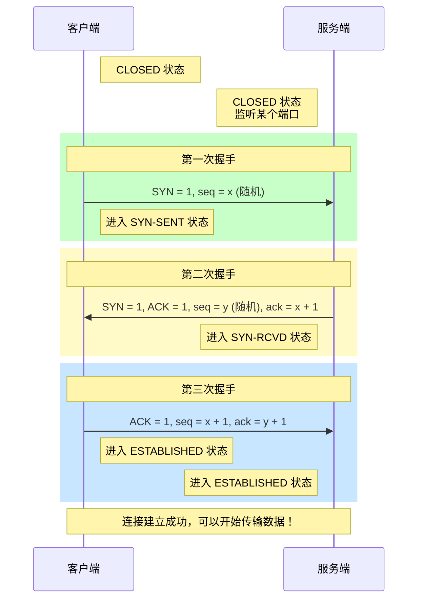
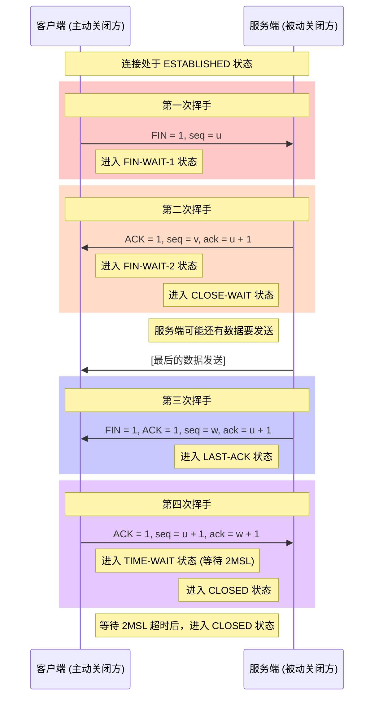

+++
date = '2025-11-18T13:27:19+08:00'
draft = false
title = 'TCP 连接本质'
+++
### 一、TCP 连接的本质

你可以把 TCP 连接想象成两个人之间打电话，确保双方都能正常收发信息后才开始正式通话。

*   **三次握手**：就像打电话时的**接通确认**过程。
*   **四次挥手**：就像通话结束时的**礼貌道别**过程。

---

### 二、三次握手 - 建立连接

**目标**：确认客户端和服务端双方的**发送**和**接收**能力都正常。

#### UML 序列图

#### 通俗的例子：打电话

假设 A（客户端） 想给 B（服务端） 打电话：

1.  **第一次握手**：A 打给 B，问：“**喂，听得到我说话吗？**”（SYN）。A 说完就等着 B 回应。
2.  **第二次握手**：B 听到了，回答：“**嗯，我听到了。那你能听到我说话吗？**”（SYN-ACK）。B 在回答的同时，也反过来确认 A 的收听能力。
3.  **第三次握手**：A 听到 B 的回答，说：“**好的，我也能听到你。**”（ACK）。

至此，双方都确认了彼此的**听（接收）**和**说（发送）**能力没问题，可以开始正式通话（数据传输）了。

#### 步骤归纳表（三次握手）

| 步骤           | 发送方 | 接收方 | 核心标志位与字段                              | 状态变化            | 通俗解释                                         |
| :------------- | :----- | :----- | :-------------------------------------------- | :------------------ | :----------------------------------------------- |
| **第一次握手** | 客户端 | 服务端 | `SYN=1`, `seq=x` (随机数)                     | 客户端：`SYN-SENT`  | 客户端：“你好，在吗？我们能开始通话吗？”         |
| **第二次握手** | 服务端 | 客户端 | `SYN=1`, `ACK=1`, `seq=y` (随机数), `ack=x+1` | 服务端：`SYN-RCVD`  | 服务端：“我在。我收到了你的请求，你准备好了吗？” |
| **第三次握手** | 客户端 | 服务端 | `ACK=1`, `seq=x+1`, `ack=y+1`                 | 双方：`ESTABLISHED` | 客户端：“我准备好了，开始通话吧！”               |

---

### 三、四次挥手 - 断开连接

**目标**：双方都确认要断开连接，并且等待未传输完的数据发送完毕，然后安全地关闭通道。

#### UML 序列图

#### 通俗的例子：挂电话

还是 A（主动方） 和 B（被动方） 在通话：

1.  **第一次挥手**：A 说：“**我要说的事情都说完了，我要挂电话了。**”（FIN）。A 不再说话，但耳朵还听着。
2.  **第二次挥手**：B 听到后说：“**哦，好的。**”（ACK）。但 B 可能还有话没说完，比如“对了，还有一件事...”。
    *   **`CLOSE-WAIT` 状态**：就是 B 在说这些“最后一件事”的阶段。
3.  **第三次挥手**：B 把所有话都说完了，然后说：“**好了，我也说完了，我也要挂电话了。**”（FIN）。
4.  **第四次挥手**：A 听到 B 的挂断请求，说：“**好的，挂吧。**”（ACK）。然后 A 不会立刻消失，而是会等一小段时间（**TIME-WAIT**），防止 B 没收到自己的确认，B 可以重发挂断请求。

B 收到 A 的“好的，挂吧”之后，就立刻挂断电话了。A 等待一段时间后，也挂断电话。

**为什么需要 `TIME-WAIT` 状态？**
为了防止最后一个 ACK 包丢失。如果 A 发完 ACK 就直接消失，而 B 没收到这个 ACK，B 会超时重发 FIN 请求。但此时 A 已经不存在了，B 就会一直重试，无法正常关闭。A 等待一段时间（2MSL），如果期间收到 B 重发的 FIN，就再发一个 ACK，确保连接能正常关闭。

#### 步骤归纳表（四次挥手）

| 步骤             | 发送方          | 接收方 | 核心标志位与字段                     | 状态变化                                            | 通俗解释                                                |
| :--------------- | :-------------- | :----- | :----------------------------------- | :-------------------------------------------------- | :------------------------------------------------------ |
| **第一次挥手**   | 客户端 (主动方) | 服务端 | `FIN=1`, `seq=u`                     | 客户端：`FIN-WAIT-1`                                | 客户端：“我说完了，准备挂断。”                          |
| **第二次挥手**   | 服务端          | 客户端 | `ACK=1`, `seq=v`, `ack=u+1`          | 服务端：`CLOSE-WAIT` 客户端：`FIN-WAIT-2`        | 服务端：“收到你的挂断请求。” (但服务端可能还有数据要发) |
| **（数据传输）** | 服务端          | 客户端 | [发送剩余数据]                       | 服务端：`CLOSE-WAIT`                                | 服务端发送最后没说完的话。                              |
| **第三次挥手**   | 服务端          | 客户端 | `FIN=1`, `ACK=1`, `seq=w`, `ack=u+1` | 服务端：`LAST-ACK`                                  | 服务端：“我也说完了，我也准备挂了。”                    |
| **第四次挥手**   | 客户端          | 服务端 | `ACK=1`, `seq=u+1`, `ack=w+1`        | 客户端：`TIME-WAIT` (等待 2MSL) 服务端：`CLOSED` | 客户端：“好的，挂吧。” (并等待以防对方没收到)           |

---

### 总结

*   **三次握手**：是连接的开始，**双方平等地确认彼此的收发能力**。少了任何一步，都无法确认通道是双向畅通的。
*   **四次挥手**：是连接的结束，由于**数据传输是双向独立的**，所以关闭也需要两个来回（一方发起关闭，另一方确认并完成自己的发送后再发起关闭）。多出来的一个来回和等待状态，都是为了**可靠和优雅地关闭**。

希望这个结合了技术细节、图表和例子的解释能帮助你彻底理解 TCP 的握手与挥手过程！
