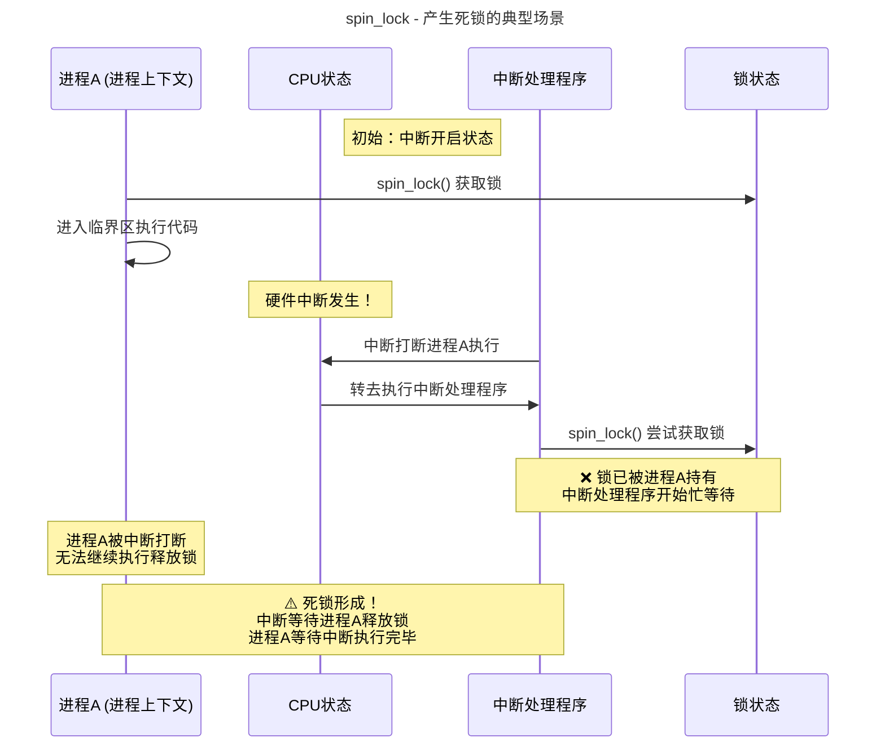
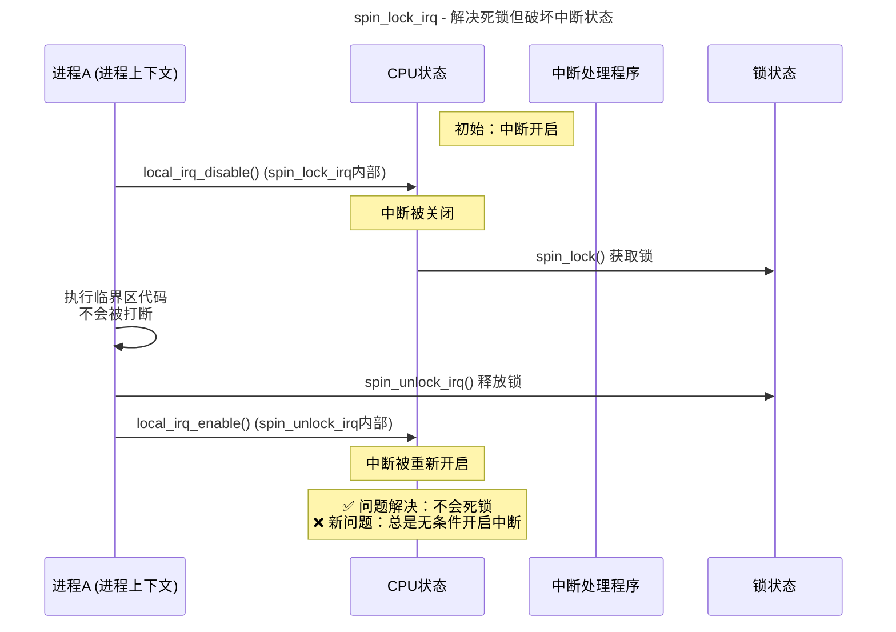
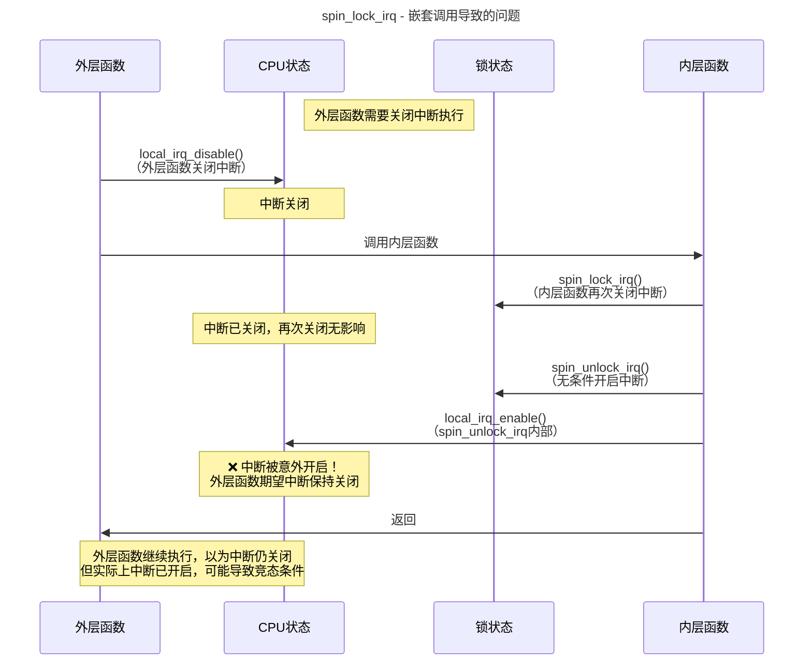
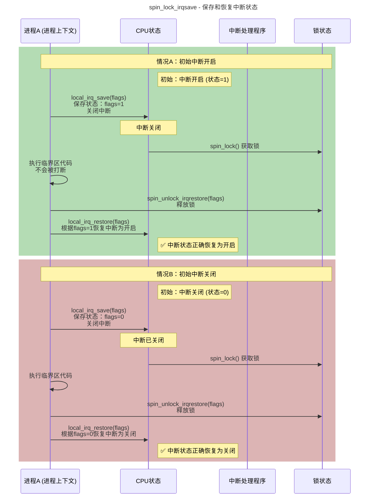
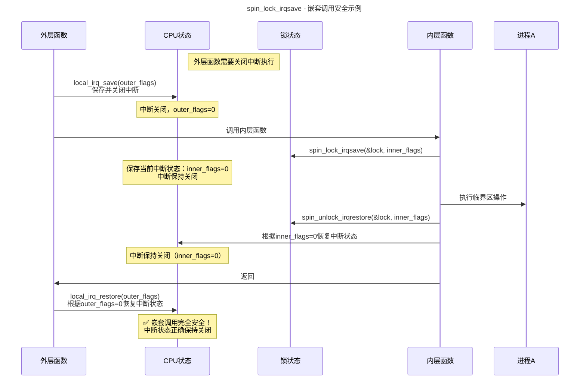
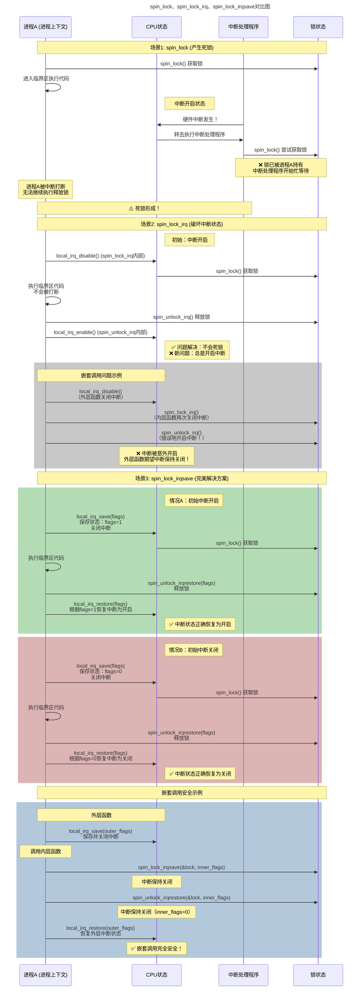
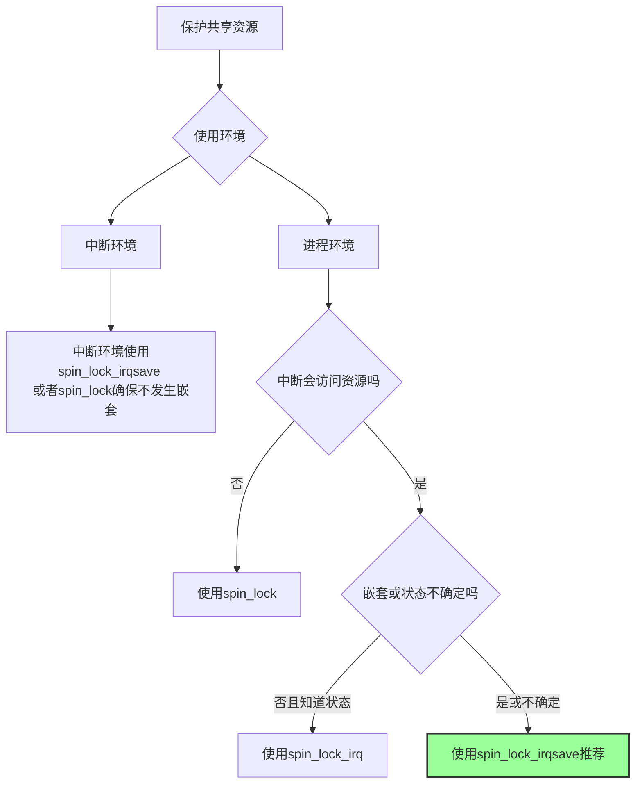

+++
date = '2026-03-27T20:30:36+08:00'
draft = false
title = 'Spin_lock'
+++

## 同步管理

参考奔跑吧linux内核：		

​		计算机术语中，临界区是指访问和操作共享数据的代码段，这些资源无法同时被多个执行线程访问，访问临界区的执行线程或代码路径称为并发源。为了避免临界区中的并发访问，开发者必须保证访问临界区的原子性，也就是说在临界区内不能有多个并发源同时执行，整个临界区就像一个不可分割的整体。

在内核中产生并发访问的并发源主要有如下4种。

中断和异常：中断发生后，中断处理程序和被中断的进程之间有可能产生并发访问。

软中断和tasklet：软中断或者tasklet可能随时被调度执行，从而打断当前正在执行的进程上下文。

内核抢占：调度器支持可抢占特性，会导致进程和进程之间的并发访问。

多处理器并发执行：多处理器上可以同时运行多个进程。

​	上述情况需要将单核和多核系统区别对待。对于单处理器的系统，主要有如下并发源。中断处理程序可以打断软中断、tasklet和进程上下文的执行。软中断和tasklet之间不会并发，但是可以打断进程上下文的执行。在支持抢占的内核中，进程上下文之间会产生并发。在不支持抢占的内核中，进程上下文之间不会产生并发。对于SMP系统，情况会更为复杂。

# 原子操作：

​	原子操作用来保护单一变量----->  演进到对链表，红黑树的保护自旋锁

底层实现是什么？主要是由于不同的架构会有不同的实现机制，x86主要机制是硬件元语言：Lock.

# **自旋锁**:

​		忙等待的锁机制。操作系统中锁的机制分为两类，一类是忙等待，另一类是睡眠等待。自旋锁属于前者，当无法获取自旋锁时会不断尝试，直到获取锁为止。同一时刻只能有一个内核代码路径可以获得该锁。

**自旋锁在**多cpu竞争情况：

​		特别是在很多CPU争用同一个自旋锁时，会导致严重的不公平性及性能下降。当该锁被释放时，事实上刚刚释放该锁的CPU有可能又马上获得该锁的使用权，或者说在同一个 NUMA 节点上的CPU有可能抢先获取了该锁，而没有考虑那些已经在锁外面等待了很久的CPU。刚刚释放锁的CPU的L1缓存中存储了该锁，它比别的CPU更快获得锁，这对于那些已 经等待很久的 CPU 是不公平的。在 NUMA 处理器中，锁争用的情况会严重影响系统的性能。有测试表明，在一个两插槽的 8 核处理器中，自旋锁争用情况愈发明显，有些线程甚至需要尝试1000000次才能获取锁。

自旋锁实现的FIFO-Tick-Base算法。酒店排队吃饭的情况！！！

# 自旋锁变种：

spin_lock出现死锁的原因：

​			在驱动中很多操作都需要访问和更新该链表，例如 open、ioctl 等。操作链表的地方就是一个临界区，需要自旋锁来保护。当处于临界区时发生了外部硬件中断，此时系统暂停当前进程的执行而转去处理该中断。**假设中断处理程序恰巧也要操作该链表**，链表的操作是一个临界区，那么在操作之前要调用spin_lock()函数对该链表进行保护。中断处理函数试图去获取该自旋锁，但因为它已经被别人持有了，导致中断处理函数进入忙等待状态或者睡眠状态。在中断上下文出现忙等待或者睡眠状态是致命的，中断处理程序要求“短”和“快”，锁的持有者因为被中断打断而不能尽快释放锁，而中断处理程序一直在忙等待锁，从而导致死锁的发生。

## spin_lock产生死锁



**使用spin_lock_irq解决使用 spin_lock出现死锁的情况：**		

​	**spin_lock_irq()**函数的实现比spin_lock()函数多了一个local_irq_disable()函数，该函数用于关闭本地处理器中断，这样在获取自旋锁时可以确保不会发生中断，从而避免发生死锁问题，spin_lock_irq()主要防止本地中断处理程序和持有锁者之间存在锁的争用。可能有的读者会有疑问，既然关闭了本地CPU的中断，那么别的CPU依然可以响应外部中断，会不会也有可能死锁呢？持有锁者在CPU0上，CPU1响应了外部中断且中断处理函数同样试图去获取该锁，因为CPU0上的锁持有者也在继续执行，所以它很快会离开临界区并释放锁，这样CPU1上的中断处理函数可以很快获得该锁。

```
进程A持有锁
    ↓
    |---> 临界区开始 (spin_lock)
    |        |
    |        | ← 硬件中断发生！
    |        |    CPU转去执行中断处理程序
    |        |    
    |        |   中断处理程序也需要同一把锁
    |        |   尝试 spin_lock()
    |        |   ↓
    |        |   发现锁已被进程A持有
    |        |   ↓
    |        |   忙等待... (死锁！)
    |        |   
    |        | 进程A无法继续执行释放锁
    |        | 因为被中断打断了
    ↓        ↓
   (永远等待)
```

为什么会有**spink_lock_irqsave**

​		在上述场景中，如果CPU0在临界区中发生了进程切换，会是什么情况？注意进入自旋锁之前已经显式地调用 preempt_disable()关闭了抢占，因此内核不会主动发生抢占。但令人担心的是，**驱动程序编写者主动调用睡眠函数，**从而发生了调度。使用自旋锁的重要原则是：拥有自旋锁的临界区代码必须是原子执行，不能休眠和主动调度。但在实际工程中，**驱动代码编写者却常常容易犯错误。例如调用分配内存函数kmalloc()时，就有可能因为系统空闲内存不足而睡眠等待**，除非显式地使用GFP_ATOMIC分配掩码。spin_lock_irqsave()函数会保存本地CPU当前的irq状态并且关闭本地CPU中断，然后获取自旋锁。local_irq_save()函数在关闭本地CPU中断前把CPU当前的中断状态保存到flags变量中；在调用local_irq_restore()函数时把flags值恢复到相关寄存器中.

## Spink_lock_irq解决死锁




## spin_lock_irq 嵌套错误：

 那如何解决嵌套错误勒，之后就出现了spin_lock_irq_save。




## Spin_lock_irqsave解决spin_lock_irq嵌套




## spin_lock_irqsave嵌套调用安全示例




对以上各个场景的解释：




## 自旋锁使用判断




# RT实时自旋锁区别

​		如果在一次项目中有的代码使用spin_lock()，而有的代码使用raw_spin_lock()，并且发现spin_lock()直接调用raw_spin_lock()，读者可能会有困惑。这要从Linux内核的实时补丁RT-patch说起。实时补丁旨在提升Linux内核的实时性，它允许在自旋锁的临界区内被抢占，且临界区内允许进程睡眠等待，这样会导致自旋锁语义被修改。当时内核中大约有10 000多处使用了自旋锁，直接修改自旋锁的工作量巨大，但是可以修改那些真正不允许抢占和休眠的地方，大概有100多处，因此改为使用raw_spin_lock。自旋锁和 raw_spin_lock 的区别在于：在绝对不允许被抢占和睡眠的临界区，应该使用raw_spin_lock，否则使用自旋锁。因此对于没有打上RT-patch的Linux内核来说，spin_lock()直接调用raw_spin_lock()；对于打上了 RT-patch 的 Linux 内核，自旋锁变成可抢占和睡眠的锁，这一点需要特别注意。

